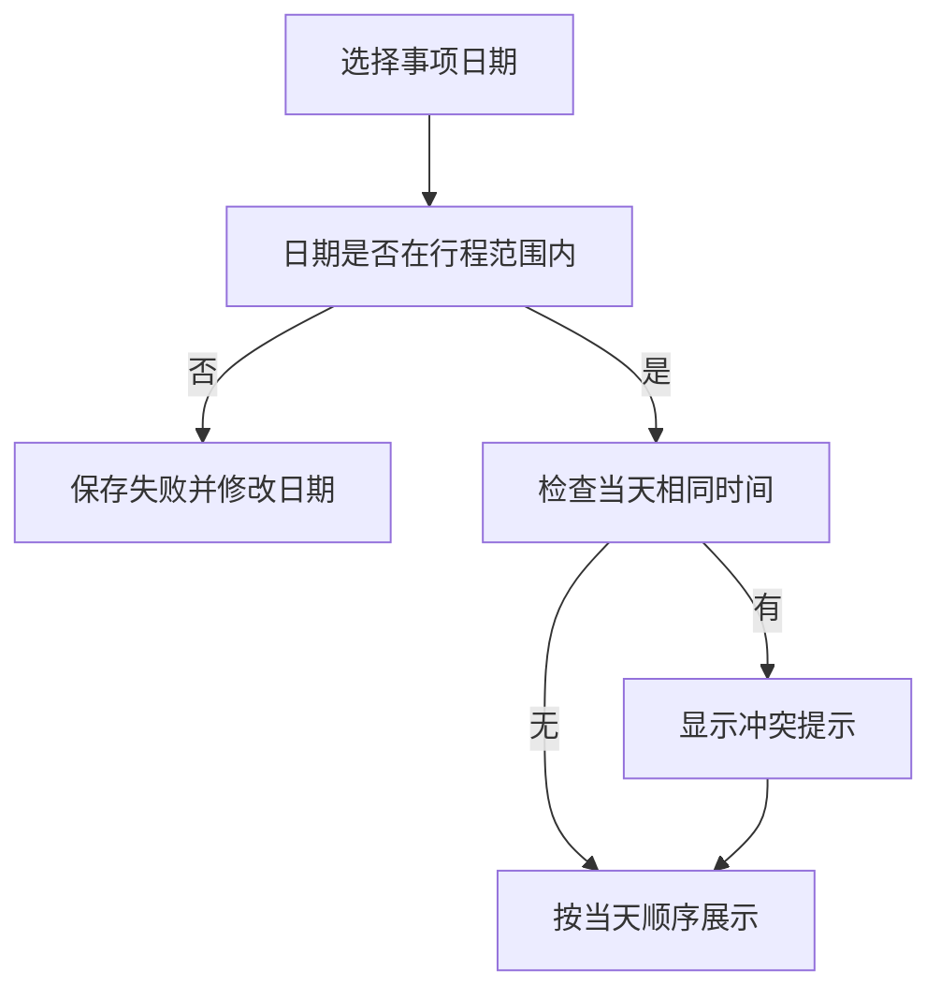
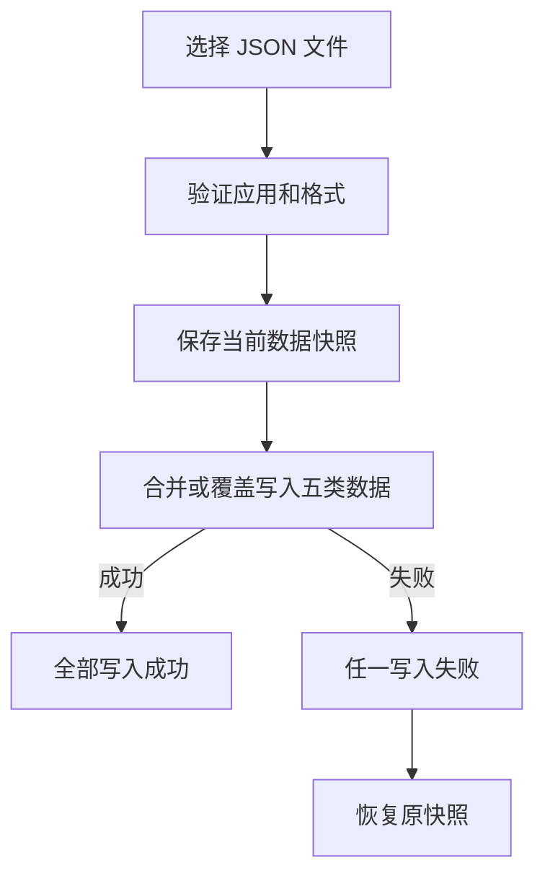

# 日常工具箱用户手册

<!-- 此文件由 scripts/generate-user-guide.js 根据 miniprogram/packages/tools/help/helpContent.js 生成，请勿手工编辑。 -->

> 适用版本：微信小程序纯前端版 1.11.4（备份格式 v3） 
> 更新日期：2026-08-01 
> 本手册与小程序内帮助使用同一份内容源，功能名称和入口保持一致。
> 需要长期保留的业务数据只保存在当前设备；日期、换算、二维码和截图打码属于临时工具；两个模拟器的探索统计只记录事件展示、回答次数和轮次，不记录答案内容或昵称，不联网，也不写入备份。

“日常工具箱”提供十个离线功能：日期计算、单位换算、二维码生成、截图打码、决策转盘、AA 分账、行程安排、通用清单、程序员生涯模拟和华子研发模拟。日期、换算、二维码和截图打码随开随用；两个模拟器共用按域隔离的本地探索统计，只用于减少复玩重复，不保存答案内容、昵称或账号；探索统计不进入备份，其余工具的数据彼此独立。

本手册按“先上手、再深入、最后保护数据”的顺序介绍完整操作。小程序内可搜索章节、展开步骤，并通过章节底部按钮直达对应工具。

## 目录

1. [快速开始](#section-quick)
2. [日期计算](#section-date)
3. [单位换算](#section-units)
4. [二维码生成](#section-qr)
5. [截图打码](#section-redactor)
6. [AA 分账](#section-ledger)
7. [行程安排](#section-trips)
8. [通用清单](#section-checklists)
9. [决策转盘](#section-wheel)
10. [程序员生涯模拟](#section-career)
11. [华子研发模拟](#section-huawei)
12. [本地数据与备份](#section-data)
13. [常见问题](#section-faq)

## 1. 快速开始

先选工具，再保存，再备份

首页提供十个平级工具，右上角保留帮助和数据设置。所有功能都可离线使用，不需要注册账号。

**功能入口：** 打开小程序后即进入工具箱首页；右上角可打开帮助和数据设置。

**页面直达：** 打开工具箱（`/pages/index/index`）

### 核心路径

`选择工具` → `完成操作` → `定期备份`

### 核心步骤

1. **从首页选择任务：** 日期计算、单位换算和二维码生成排在前面，其他工具继续从对应卡片进入。
2. **分清临时、存档与探索统计：** 日期、换算、二维码和截图打码退出即清空；程序员生涯会保存活动存档，华子会清空本轮内容；两个模拟器另有不含答案内容的本地探索统计。
3. **重要内容及时备份：** 需要保留后五项内容时，进入数据设置导出完整 JSON 文件。

### 使用提醒

- 卸载小程序、清理微信存储或更换设备，都可能导致本地内容不可用。
- 日期、换算、二维码、截图打码和两个模拟器的探索统计不会进入备份；备份格式仍为 v3，其余五类数据之间也没有关联 ID。

### 十个工具一览

| 工具 | 适合解决的问题 | 主要结果 |
| --- | --- | --- |
| 日期计算 | 计算间隔、日期前后和倒数日 | 可复制的日期结果 |
| 单位换算 | 转换常用公制、英制和数据单位 | 实时换算结果 |
| 二维码生成 | 把文字、网址或 Wi-Fi 转成二维码 | 可保存的高清 PNG |
| 截图打码 | 遮住聊天头像、名称和其他隐私 | 保持原尺寸的 PNG |
| 决策转盘 | 从多个候选项中做决定 | 带动画的随机结果和历史 |
| AA 分账 | 多人同行时记录共同支出 | 每个人最终应付给谁多少钱 |
| 行程安排 | 按日期组织每天的事项 | 有顺序、无时间冲突的日程 |
| 通用清单 | 打包、采购或普通待办 | 多份可排序清单和完成进度 |
| 程序员生涯模拟 | 观察选择如何影响职业路径 | 自动存档的情景模拟和生涯档案 |
| 华子研发模拟 | 识别公开研发黑话并处理典型情景 | 少重复的情景模拟、研发画像和词典 |

### 离线使用原则

- 不需要登录，打开即可使用。
- 日期、换算、二维码和截图打码只存在当前页面。
- 两个模拟器的探索统计只在本机记录事件展示、回答次数和轮次，不记录答案内容、昵称或账号。
- 其余五类工具数据分别存储，彼此不会自动创建关联。
- 日常新增和编辑不依赖网络。
- 导出的文件需要由用户自行妥善保存。
- 恢复或清空前，建议先导出一份最新备份。

## 2. 日期计算

间隔、推算和倒数一次算清

日期计算完全在当前页面完成，统一使用日历日期运算，避免跨月、闰年和时区带来的偏差。

**功能入口：** 首页点击“日期计算”。

**页面直达：** 打开日期计算（`/packages/tools/date-calculator/index`）

### 核心路径

`选择模式` → `填写日期` → `复制结果`

### 核心步骤

1. **选择计算方式：** 在日期间隔、日期推算和倒数日之间切换。
2. **填写日期与天数：** 日期推算可选择自然日或只排除周末的工作日。
3. **核对结果：** 日期间隔同时显示相隔天数、含首尾天数和周数余数。
4. **复制使用：** 点击复制结果，可直接粘贴到聊天、备忘录或行程中。

### 使用提醒

- 工作日只排除周六和周日，不包含法定节假日调休。
- 退出页面后不保存日期和计算结果。

### 三种计算方式

| 模式 | 输入 | 结果 |
| --- | --- | --- |
| 日期间隔 | 开始和结束日期 | 相隔、含首尾、周数余数 |
| 日期推算 | 基准日期、天数、方向 | 推算后的日期与星期 |
| 倒数日 | 目标日期 | 还有、今天或已经过去 |

## 3. 单位换算

常用单位即时转换

支持八类常用单位，输入后立即更新结果。换算规则随程序提供，不读取网络汇率。

**功能入口：** 首页点击“单位换算”。

**页面直达：** 打开单位换算（`/packages/tools/unit-converter/index`）

### 核心路径

`选择类别` → `选择或交换单位` → `复制结果`

### 核心步骤

1. **选择类别：** 在长度、面积、重量、体积、温度、时间、速度和数据容量中选择。
2. **输入数值：** 选择来源与目标单位，结果会随着输入即时变化。
3. **交换单位：** 点击中间交换按钮，快速进行反向换算。
4. **复制结果：** 复制内容会同时包含原数值、来源单位、结果和目标单位。

### 使用提醒

- 杯、品脱和加仑采用美制。
- KB 使用 1000 字节，KiB 使用 1024 字节。
- 不提供汇率换算；退出页面后不保存输入。

### 容易混淆的单位

| 单位 | 定义 |
| --- | --- |
| KB / MB / GB | 按 1000 进位 |
| KiB / MiB / GiB | 按 1024 进位 |
| 杯 / 品脱 / 加仑 | 采用美制容量 |

## 4. 二维码生成

文字、网址和 Wi-Fi 本地成码

二维码在设备本地生成，不上传输入内容。生成后可以复制原文或保存高清 PNG。

**功能入口：** 首页点击“二维码生成”。

**页面直达：** 打开二维码生成（`/packages/tools/qr-generator/index`）

### 核心路径

`填写内容` → `生成二维码` → `保存图片`

### 核心步骤

1. **选择内容类型：** 普通模式可输入文字或网址，Wi-Fi 模式填写名称、安全类型和密码。
2. **生成二维码：** 内容不超过 1000 个 UTF-8 字节时，可生成带标准留白的二维码。
3. **保存或复制：** 二维码可保存到相册，原始内容也可复制到剪贴板。
4. **修改后重新生成：** 输入发生变化时旧预览会失效，防止误保存旧内容。

### 使用提醒

- 本功能生成标准二维码，不是微信小程序码。
- 保存图片需要微信相册权限。
- 退出页面后文字、Wi-Fi 名称和密码都会清空，也不会进入备份。

### Wi-Fi 二维码字段

| 字段 | 说明 |
| --- | --- |
| 名称 | 需要连接的 Wi-Fi SSID |
| 安全类型 | WPA/WPA2、WEP 或无密码 |
| 隐藏网络 | 网络不广播名称时打开 |
| 密码 | 无密码网络不需要填写 |

## 5. 截图打码

聊天截图离线遮挡隐私

选择一张聊天截图后，工具会先排除顶部聊天栏和底部输入工具栏，再结合边缘位置、方形边界和紧邻消息结构，保守地尝试标记头像、群昵称和顶部标题。识别不读取姓名文字，也不会上传图片，保存前仍需人工检查。

**功能入口：** 首页点击“截图打码”。

**页面直达：** 打开截图打码（`/packages/tools/screenshot-redactor/index`）

### 核心路径

`选择截图` → `检查候选` → `保存原图`

### 核心步骤

1. **从相册选择截图：** 每次只处理一张图片，选中后会在设备本地分析常见聊天布局。
2. **检查自动标记：** 绿色边框表示较可靠候选，琥珀色表示保守回退区域。页面会分别显示头像和名称数量，请逐一检查遗漏或误判。
3. **补充或调整：** 使用移动模式选择、移动、缩放或删除区域；使用框选或涂抹补充需要隐藏的内容。
4. **选择遮挡效果：** 可使用马赛克、模糊或黑灰白纯色；未选中边框时调整全部区域，点中边框后只调整所选区域。强度滑块会在拖动时实时预览，马赛克和模糊保留有效的最低强度。
5. **保存到相册：** 工具会重新按原始像素尺寸绘制 PNG。设备无法处理超大长截图时会明确提示，不会静默降低清晰度。

### 使用提醒

- 自动识别依赖聊天页面布局，不是人脸识别或文字识别，保存前必须检查结果。
- 识别会优先减少误判；特殊主题、裁剪截图或头像离边缘较远时，可能需要框选补充。
- 隐私内容优先使用纯色；使用马赛克或模糊时，放大预览确认文字、头像或号码已经无法辨认。
- 双指可缩放画面；移动模式下拖动空白区域可以查看长截图。
- 重新编码会移除原图附带的元数据，但不会改变原相册中的图片。
- 图片、候选和撤销记录只在当前页面存在，不进入工具箱备份。

### 三种编辑模式

| 模式 | 用途 | 手势 |
| --- | --- | --- |
| 移动 | 查看图片和调整已有区域 | 拖动画面；点选区域后移动或拖右下角缩放 |
| 框选 | 精确遮挡名称、号码或一段文字 | 从一角拖到另一角 |
| 涂抹 | 快速覆盖遗漏的小范围内容 | 在目标内容上划过 |

### 自动识别边界

- 先定位消息内容的上下边界，底部语音、表情和加号等输入工具栏控件不参与头像识别。
- 分析左右边缘的方形边界，并要求内侧紧邻名称或消息；远处气泡不能为无关图块提供依据。
- 根据头像和气泡的相对位置推断名称区域，并剔除少量孤立壁纸边缘，不读取名称文字。
- 顶部标题使用聊天栏位置规则标记。
- 特殊主题、裁剪截图或不常见聊天软件可能需要手动补充。

## 6. AA 分账

共同花费记清楚，结算结果算准确

先建立账本和同行人，再记录每笔费用由谁支付、哪些人参与分摊。系统始终使用整数最小货币单位计算，避免浮点误差。

**功能入口：** 首页点击“AA 分账”。

**页面直达：** 打开 AA 分账（`/pages/ledger/index/index`）

### 核心路径

`添加同行人` → `记录支出` → `完成结算`

### 核心步骤

1. **新建账本：** 填写账本名称和币种，再逐个添加同行人。
2. **录入共同支出：** 填写金额、付款人，并勾选实际参与平分的人。
3. **核对余额：** 查看每个人已付、应付和差额，确认遗漏或参与人选择错误。
4. **执行结算：** 按系统建议登记转账，可部分结算、撤销，并导出结算图片或 PDF。

### 使用提醒

- 一笔费用只记录一次；付款人和参与人是两个不同概念。
- 不同币种分开计算，不会自动换算。
- 涉及钱款时，导出前请与同行人共同核对原始支出。

### 建账与添加同行人

1. 点击新建账本，输入容易识别的名称。
2. 确认账本币种。
3. 使用新增同行人操作逐个添加成员。
4. 成员齐全后再录入共同支出。

同行人姓名只用于当前账本。不同账本中的同名成员互不影响，因此可以分别记录不同出行组合。

### 一笔费用怎样分

| 字段 | 含义 | 例子 |
| --- | --- | --- |
| 金额 | 这笔共同费用的总额 | 晚餐 300 元 |
| 付款人 | 实际垫付整笔费用的人 | 小林 |
| 参与人 | 应该承担这笔费用的人 | 小林、小周、小吴 |
| 分摊结果 | 每个参与人应承担的份额 | 每人 100 元 |

### 结算、撤销与导出

- 结算建议会尽量减少转账次数。
- 实际只转了一部分时，按实际金额登记部分结算。
- 登记错误可以撤销，再按正确金额重做。
- 结算图片适合快速发送，PDF 适合保存完整明细。
- 导出结果前应再次检查币种、人员和支出总额。

## 7. 行程安排

只管理日期和每天事项

用目的地、起止日期和按天事项组织一次出行。事项支持排序，时间重复时会给出冲突提示。

**功能入口：** 首页点击“行程安排”。

**页面直达：** 打开行程安排（`/pages/trip/index`）

### 核心路径

`创建行程` → `添加事项` → `检查冲突`

### 核心步骤

1. **填写基础信息：** 设置行程名称、目的地、开始日期和结束日期。
2. **按天添加事项：** 选择行程范围内的日期，可补充时间、标题、位置和备注。
3. **调整当天顺序：** 使用上移、下移或排序操作，把事项排成实际执行顺序。
4. **处理时间冲突：** 同一天相同时间出现多个事项时，根据提示修改时间或确认安排。

### 使用提醒

- 事项日期必须位于行程开始和结束日期之间。
- 未填写具体时间的事项仍可保存，并按手工顺序展示。
- 复制行程会生成独立副本，修改副本不会影响原行程。

### 创建和维护行程

1. 新建行程并填写名称、目的地和日期范围。
2. 进入行程详情，选择某一天新增事项。
3. 填写时间和标题；位置、备注可选。
4. 保存后在当天列表中检查顺序和冲突提示。
5. 需要复用时复制整份行程，再编辑副本。

### 时间与顺序的关系

时间用于发现明显冲突，顺序用于表达当天实际先后。即使两个事项都没有时间，也可以通过调整顺序安排它们。

### 编辑和删除

- 修改日期范围前，先确认现有事项是否仍在新范围内。
- 删除事项只影响当前行程。
- 删除整份行程前会要求确认。
- 行程内容不会自动写入其他工具。

## 8. 通用清单

打包、采购和待办都能记

可创建多份互相独立的清单，从空白开始或套用旅行打包模板。每份清单都有完成进度和可排序项目。

**功能入口：** 首页点击“通用清单”。

**页面直达：** 打开通用清单（`/pages/checklist/index`）

### 核心路径

`创建清单` → `添加项目` → `勾选完成`

### 核心步骤

1. **选择创建方式：** 新建空白清单，或使用旅行打包模板快速生成常用项目。
2. **增删和编辑项目：** 输入项目文字后添加，长按或打开操作菜单可编辑、移动或删除。
3. **跟踪完成进度：** 勾选完成后，顶部进度会同步更新。
4. **维护多份清单：** 在清单选择器中切换，可重命名、清除已完成项目或删除整份清单。

### 使用提醒

- 多次使用旅行模板会新建独立清单，不会重复插入到当前清单。
- 清除已完成项目不可撤销，执行前请确认。
- 给清单使用明确名称，例如“周末采购”或“东京打包”。

### 空白清单与旅行模板

| 创建方式 | 适合场景 | 初始内容 |
| --- | --- | --- |
| 空白清单 | 采购、家务、工作待办等 | 只有标题，项目由用户添加 |
| 旅行打包模板 | 出发前检查随身物品 | 生成一组常用打包项目 |

模板只负责创建初始内容。创建后可自由编辑、移动和删除，不会改变下一次新建模板的默认项目。

### 项目状态和排序

- 上移或下移只改变当前清单中的顺序。
- 取消勾选后，项目会重新计入未完成数量。
- 清除已完成只删除已勾选项目，未完成项目和顺序保留。
- 删除整份清单会同时删除其中所有项目。

## 9. 决策转盘

把候选项交给一次有过程的随机选择

输入多个候选项并保存为转盘，可以点击旋转，也可以用手势拨动。停止后显示结果并写入历史。

**功能入口：** 首页点击“决策转盘”。

**页面直达：** 打开决策转盘（`/packages/tools/wheel/index`）

### 核心路径

`输入选项` → `拨动转盘` → `查看结果`

### 核心步骤

1. **新建或选择转盘：** 为当前决定命名，逐项添加或批量粘贴候选内容。
2. **管理有效选项：** 暂时不参与抽取的选项可以停用，需要时再恢复。
3. **开始旋转：** 点击旋转按钮，或在转盘上做拨动手势触发带减速效果的动画。
4. **查看和复用结果：** 结果会进入历史，可继续旋转、修改选项或切换已保存转盘。

### 使用提醒

- 至少保留两个启用选项，结果才有选择意义。
- 停用不会删除选项，恢复后仍可继续参与。
- 旋转过程中不要连续重复触发，等待指针稳定后再读取结果。

### 准备候选项

- 逐项输入适合少量候选。
- 批量输入适合一次粘贴多行文本。
- 相同文字会让结果难以区分，建议先整理重复项。
- 暂时不需要的选项使用停用，不必删除。
- 多个决定可分别保存为不同转盘。

### 一次完整旋转

最终结果以固定指针指向的扇区为准。转盘主体旋转而页面布局保持稳定，动画结束后才会确认并记录结果。

### 保存、历史和停用

| 操作 | 是否保留内容 | 用途 |
| --- | --- | --- |
| 保存转盘 | 保留名称和选项 | 下次继续使用同一组候选 |
| 停用选项 | 保留选项 | 暂时排除，不参加本次选择 |
| 删除选项 | 不保留 | 永久移除无效候选 |
| 查看历史 | 保留历次结果 | 回看之前抽中的内容 |

## 10. 程序员生涯模拟

在职业情景中观察选择的后续影响

从入行求职走到职业答案，在六个阶段中做出不能撤销的选择。360 个职业情景覆盖 AI、安全、伦理、开源、管理、人生变量和虚构戏剧性职场转折；五项属性、隐藏经历和延迟后果会共同影响事件走向与最终答案。结果来自预设情景和本地规则，仅用于选择反思，不构成职业建议。

**功能入口：** 首页点击“程序员生涯模拟”。

**页面直达：** 打开程序员生涯模拟（`/packages/tools/career/index`）

### 核心路径

`选择模式` → `做出选择` → `观察答案`

### 核心步骤

1. **选择模拟模式：** 自由模拟会结合本机探索统计优先安排新经历；今日情景在同一天使用固定题序，方便对照不同选择。
2. **阅读剧情并选择：** 选项正文完整显示，影响方向标签排列在正文下方；具体数值、隐藏经历和远期后果要在选择后揭晓。
3. **观察画像和伏笔：** 职业画像会随路线变化；结果页会提示仍在发酵的伏笔，但不会提前剧透具体后果。
4. **完成章节复盘：** 每章结束时查看五项属性净变化、选择风格和本章关键转折。
5. **自动保存进度：** 每次选择后都会立即保存当前剧情、属性和经历，退出后可从准确步骤继续。
6. **整理并分享：** 生涯档案会整理十二种职业答案、十二项里程碑和事件图鉴；模拟总结可复制给朋友。

### 使用提醒

- 选择不能撤销；重新模拟会要求二次确认。
- 技术力、沟通力、精力、积蓄和影响力都限制在 0 至 100。
- 属性过低会触发危机与补救事件，不一定立即结束生涯。
- 一局固定经历 36 个抉择；自由模拟首轮每阶段 4 个主线加 2 个支线，复玩调整为 1 个主线加 5 个优先新事件。
- 今日情景题序固定，不受个人探索统计影响；其中遇到的事件仍会计入发现进度。
- 生涯数据只保存在本地，请通过数据设置定期导出完整备份。

### 自由模拟与今日情景

| 模式 | 事件规则 | 适合场景 |
| --- | --- | --- |
| 自由模拟 | 首轮每阶段 4 主线 + 2 支线；复玩 1 主线 + 5 个优先新事件 | 持续发现更多情景组合 |
| 今日情景 | 同一天使用固定题序，不受个人统计影响 | 对照同题下的不同选择 |

两种模式都从入行求职开始，依次经历初级生存、独当一面、核心骨干、路线分叉和职业答案。事件库共有 360 个情景，一局仍是 36 个抉择。自由模拟首轮每阶段安排 4 个剧情主线和 2 个支线；第二轮起每阶段最多保留 1 个主线，其余 5 个位置根据解锁条件、当前经历和本机发现进度优先安排未见事件。相同种子、相同经历和相同统计快照会得到一致结果。

- AI 时代、安全警报、伦理岔路、社区回响和人生变量等标签会提示事件主题，不代表选项优劣。
- 部分支线只会在早期做出相关选择、积累对应经历或属性达到条件后出现。
- 今日情景保持同日固定题序，个人发现进度不会改变题目，但展示和回答仍计入探索统计。
- 生涯档案中的事件图鉴按所有完成与中断记录累计，重复事件只计算一次。

### 本地探索统计怎样工作

- 程序员生涯模拟和华子研发模拟共用同一套统计基础设施，但两个模拟器的数据按域隔离。
- 统计只包含事件展示次数、回答次数、首次与最近出现轮次、最近事件和最近运行摘要。
- 统计不记录用户选择了哪个答案、答案正文、结果正文、昵称或账号，也不会联网。
- 发现进度、本轮新题数和新题率来自这份统计，只用于改善本机复玩体验。
- 探索统计不进入工具箱备份 v3；在数据设置中清空全部数据会一并删除。

### 五项属性

| 属性 | 代表什么 | 可能影响 |
| --- | --- | --- |
| 技术力 | 解决工程问题和持续学习的能力 | 技术事件、架构路线和专业答案 |
| 沟通力 | 表达、协作与处理分歧的能力 | 团队信任、管理路线和危机处理 |
| 精力 | 维持工作和生活状态的余量 | 连续高压、补救事件和燃尽风险 |
| 积蓄 | 面对变化时可支配的经济缓冲 | 副业、独立路线和风险选择 |
| 影响力 | 让成果被看见并推动他人的能力 | 晋升、开源、产品与创业路线 |

属性变化会被限制在 0 至 100。选择前只显示影响方向，选择后才展示实际增减；团队信任、职业原则、开源经历等隐藏状态不会直接显示数值。

### 选择反馈、职业画像与章节复盘

- 结果页会说明本次剧情反馈和可见属性变化。
- 部分影响会作为延迟后果，在后续章节才触发。
- 职业画像会综合五项属性、选择标签和隐藏经历实时变化。
- 每章结束时会汇总属性净变化、路线风格和关键转折。
- 反馈阶段重复点击不会再次应用同一选择。
- 自动存档会记录当前事件、反馈阶段、章节总结或职业答案状态。
- 强制关闭后重新进入，也会回到最近一次成功保存的位置。

### 生涯档案、事件图鉴与职业答案

| 职业答案 | 代表路线 |
| --- | --- |
| 首席架构师 | 持续深耕技术与系统设计 |
| 技术负责人 | 技术判断与团队影响并重 |
| 工程经理 | 转向协作、培养与组织管理 |
| 独立开发者 | 依靠技术、积蓄和产品意识独立前进 |
| 创业合伙人 | 承担高风险并推动产品与团队 |
| 开源之星 | 长期贡献开源并建立行业影响 |
| 远程游牧 | 用能力和积蓄换取地点自由 |
| 生活优先 | 主动守住精力和生活边界 |
| 产品转型 | 从工程实现走向用户与产品判断 |
| 稳健老兵 | 保持稳定节奏并积累长期经验 |
| 高薪燃尽 | 收入增长但精力被持续透支 |
| 被优化的一天 | 在危机中未能完成补救 |

- 生涯档案保留每次完成或中断的模拟记录。
- 已完成生涯可查看最终属性、职业画像、关键词、关键选择和职业答案。
- 职业答案集显示发现进度；未发现答案只提供轮廓和模糊提示。
- 十二项职业里程碑会跨多段生涯累计，包括今日情景、危机处理和多答案探索。
- 事件图鉴显示已经遇见的情景数量，总数为 360；多走不同路线会解锁更多条件支线。
- 展开任一生涯可复制文字总结，方便与朋友对照路线。
- 同一职业答案可以通过不同选择路径到达，重新模拟不会删除旧档案。

### 离线存档与备份

- 生涯模拟不需要登录或联网，活动进度和生涯档案都保存在当前设备。
- 关闭微信不会主动删除存档，但卸载小程序、清理存储或更换设备可能导致数据丢失。
- 完整备份格式 v3 的 careerRuns 集合包含活动生涯、模式、历史档案、属性、选择和职业答案；职业画像、里程碑和事件图鉴可由存档重新计算。
- 用于自适应抽题的探索统计与生涯存档分开保存，不进入备份；导入生涯存档后可从存档重新建立程序员事件发现进度。
- 换设备前先从数据设置导出 JSON 文件，再在新设备选择合并或覆盖恢复。
- 恢复失败时五类业务数据会一起回滚到导入前状态。

## 11. 华子研发模拟

听懂公开黑话，也看见选择代价

这是非官方的研发文化情景模拟。48 个词条整理自企业公开材料、公开管理资料、行业通用表达和单独标记的网络职场叙事；192 个遭遇全部是虚构复合创作，不代表任何企业、团队或员工的真实经历。每次从五个阶段抽取 15 个情景，第二轮解锁 10 个复玩支线，并通过共享的本地自适应选择器优先安排未见内容。

**功能入口：** 首页点击“华子研发模拟”。

**页面直达：** 打开华子研发模拟（`/packages/tools/huawei-sim/index`）

### 核心路径

`看懂词条` → `处理情景` → `生成画像` → `解锁新支线`

### 核心步骤

1. **开始一次模拟：** 系统按种子从入场对齐、版本攻坚、一线协同、路线抉择和绩效与去留中各抽取三个情景。
2. **阅读人话翻译：** 每个情景会关联一个词条，并把缩写或文化表达翻译成通俗含义。
3. **做出不能重复结算的选择：** 选项会改变交付信用、技术深度、能量余量和组织影响，反馈出现后才能进入下一题。
4. **查看研发画像：** 十五次选择结束后生成本地画像、路线关键词、四项数值和完整现场记录。
5. **继续探索新内容：** 完成首轮后会解锁十个复玩专属情景；第二轮优先安排刚解锁和未见事件，之后再根据冷却期和出现频率平衡重复。
6. **按需查询词典：** 词典支持关键词与分类筛选，可以复制解释，但不会保存搜索内容。

### 使用提醒

- “华为公开材料”只表示该术语可在公开页面中找到，不表示本模拟由华为提供、认可或背书。
- PBC、DSTE、LTC、CBB 及职场通用表达来自公开管理或行业资料，不声称属于某一家企业独有。
- “网络职场叙事”来自二手公开报道，只作为虚构素材入口，不代表官方制度、普遍经历或事实认证。
- 模拟不使用企业商标图形，不收集账号；具体答案内容、搜索词、昵称和结果不会写入探索统计。
- 本机探索统计只保存事件展示、回答次数和轮次，用于减少复玩重复；这些统计不联网，也不进入完整备份。
- 重新开始或离开页面会清空本轮选择和结果，但不会抹掉已经发现过哪些情景。
- 情景用于观察取舍，不构成职业建议或对真实工作环境的事实判断。

### 内容规模与结构

| 内容 | 规模 | 用途 |
| --- | --- | --- |
| 黑话词条 | 48 个 | 公开语境的通俗翻译与使用提醒 |
| 虚构情景 | 192 个 | 覆盖五个研发阶段的复合遭遇 |
| 完整选择 | 576 个 | 每个情景提供三条不同处理路线 |
| 复玩支线 | 10 个 | 完成首轮后解锁，每阶段两个 |
| 单次模拟 | 15 次选择 | 每阶段随机抽取三个情景 |
| 结果维度 | 4 项 | 交付信用、技术深度、能量余量、组织影响 |
| 研发画像 | 8 种 | 根据四项结果生成非评判性的路线提示 |

### 复玩为什么会有新内容

- 第二次模拟会解锁每个阶段两个复玩支线，共十个新情景，并优先安排刚解锁和未见内容。
- 题池容量允许时，前四次完整模拟不会重复已经见过的情景。
- 当某个阶段的题都体验过后，系统按出现次数由少到多选择，并把最近出现的题放到最后。
- 同一种子和同一份探索进度仍会得到可复现的顺序，便于测试和排查。
- 首页与结果页会显示已见题数量，本轮首次遇见的事件也会单独标记。

### 词典怎样标注来源

| 标记 | 含义 | 示例 |
| --- | --- | --- |
| 华为公开材料 | 可在企业公开治理、公开信或出版材料中找到相关语境 | 主航道、打粮食、黑土地 |
| 华为云公开文档 | 可在公开 IPD 测试指南中找到相关定义 | IPD、PDT、TR1 至 TR6 |
| 公开管理资料 | 来自公开管理案例或实践文章的通俗解释 | PBC、DSTE、LTC、CBB |
| 行业通用表达 | 互联网研发职场中普遍使用，不归属于单一企业 | 对齐、拉通、闭环、复盘 |
| 网络职场叙事 | 来自二手公开报道，不作为官方定义或普遍事实 | B里靠前、AT评议、输出非研发、当众批评 |

- 词条不是内部资料，也不包含保密文件；争议内容统一标记为“网络职场叙事”。
- 公开来源只用于解释词语出现的语境，不用于证明虚构情景真实发生过。
- 同一缩写在不同组织中可能有不同定义，实际工作应以所在团队正式流程为准。

### 虚构遭遇与安全边界

- 情景把版本评审、线上故障、客户协同、技术债、B绩效、输出非研发、高压沟通和路线选择重新创作成复合事件。
- “B里靠前”、AT评议和当众批评等内容来自公开二手叙事；不描述具体真实员工，也不把网络争议写成事实。
- 绩效与去留阶段提供询问证据、确认书面岗位条件、正式复核、合规留痕和规划离开等可执行路径。
- 选择没有唯一正确答案；反馈用于展示短期收益、长期代价和协作影响。
- 能量值过低只会生成负荷提醒，不提供医学、法律或人事判断。
- 页面标题中的“华子”是网络口语化主题称呼，不包含企业标识，也不表示官方关系。

### 临时运行与隐私

- 模拟和词典完全离线，不调用网络接口。
- 页面不要求昵称，也不收集账号、位置、联系人或设备身份。
- 当前选择、搜索词和结果只保存在页面内存。
- 共享本地统计只记录事件展示次数、回答次数、首次与最近出现轮次、最近事件和最近运行摘要，不记录答案内容。
- 两个模拟器共用统计基础设施，但 `career` 与 `huawei` 数据互相隔离。
- 离开页面或重新开始会清空本次模拟；轻量探索统计保留在本机，但不联网，也不进入工具箱备份 v3。
- 在数据设置中清空全部数据，会同时重置两个模拟器的探索统计。
- 复制词条或模拟总结时，只有用户主动复制的文字会进入系统剪贴板。

## 12. 本地数据与备份

知道数据在哪里，也知道怎样带走

数据设置集中显示本地占用和上次备份时间，并提供完整导出、恢复和清空。备份文件继续使用格式 v3，包含五类持久工具数据；不包含日期、换算、二维码、截图打码的临时输入，也不包含两个模拟器的共享探索统计。

**功能入口：** 首页右上角点击“数据设置”。

**页面直达：** 打开数据设置（`/packages/tools/data/index`）

### 核心路径

`导出备份` → `验证并恢复` → `失败自动回滚`

### 核心步骤

1. **查看本地状态：** 确认五类数据数量、本地占用和上次成功导出的时间。
2. **导出完整备份：** 生成备份格式 v3 的 JSON 文件，包含行程、清单、AA 账本、转盘和程序员生涯。
3. **选择恢复方式：** 导入有效文件后，可合并到现有数据或覆盖恢复。
4. **谨慎清空：** 清空会删除五类持久工具内容和两个模拟器的本地探索统计，操作前务必确认已有可用备份。

### 使用提醒

- 恢复会先验证文件结构；任何一类写入失败都会回到恢复前状态。
- 覆盖恢复会替换当前五类业务数据，优先使用合并导入。
- 备份文件可能包含姓名、金额和备注，请只存放在可信位置。

### 备份中包含什么

| 集合 | 内容 |
| --- | --- |
| trips | 行程和按天事项 |
| checklists | 多份清单和清单项目 |
| ledgers | AA 账本、成员、支出与结算 |
| wheels | 已保存转盘、选项和历史 |
| careerRuns | 活动生涯、历史档案、属性、选择与职业答案 |

备份顶层会标记应用身份和 schemaVersion 3。导入时会先检查版本、集合类型和重复 ID，再开始写入；旧格式 v1 缺少生涯数据时按空列表处理，v1、v2 中的快评数据会被忽略。

### 安全恢复流程

- 合并导入：保留现有内容，并加入备份中的内容。
- 覆盖恢复：以备份文件替换当前五类数据。
- 格式非法：停止导入，不修改当前数据。
- 写入失败：使用开始前的快照回滚全部数据。

### 清空前检查

1. 先导出最新完整备份。
2. 确认文件可以在文件管理中找到。
3. 核对数据设置中显示的五类数量。
4. 阅读二次确认提示后再执行清空。
5. 清空后重新进入各工具检查空状态。

## 13. 常见问题

离线工具最需要知道的几件事

遇到问题时，先确认当前工具、输入内容和最近一次备份状态。十个工具彼此独立，可以分别排查。

**功能入口：** 在小程序内帮助页搜索关键词，或从章节导航进入“问答”。

### 核心路径

`确认现象` → `检查输入` → `核对备份`

### 高频问题

#### 为什么换设备后没有数据？

内容只保存在原设备本地。需要先从原设备导出，再在新设备恢复。

#### 为什么 AA 结果和预期不同？

逐笔检查金额、币种、付款人和参与人，尤其确认没有重复录入。

#### 为什么行程事项不能保存？

确认事项日期位于行程范围内，时间格式有效，并处理页面提示的问题。

#### 为什么恢复失败？

确认选择的是本工具箱导出的格式 v1、v2 或 v3 JSON 文件，并且文件没有被手工改坏。

#### 为什么截图没有全部自动打码？

自动识别只依据常见聊天布局生成候选，不读取文字或识别人脸。请切换到框选或涂抹模式补充遗漏，放大检查每一处隐私后再保存。

### 使用提醒

- 发现异常时先停止继续修改，并导出当前数据留存。
- 清空数据不能撤销，只能从此前备份恢复。
- 导出文件包含个人内容，不要随意转发。

### 数据与设备

#### 关闭微信后内容还在吗？

正常关闭不会主动删除本地内容。再次进入工具时会从本地读取；仍建议定期导出备份。

#### 换设备怎样继续使用？

在原设备导出完整备份，把 JSON 文件转移到新设备，再从数据设置中恢复。

#### 导入失败会不会破坏现有内容？

不会。文件会先验证，写入前也会保存快照；任一集合写入失败时会回滚。

#### 清空后还能撤销吗？

不能直接撤销。只有在清空前已经导出有效备份时，才能通过恢复找回。

### 功能排查

#### AA 金额为什么会相差一分钱？

金额不能整除时必须分配最小单位尾差。系统保证所有参与人的份额总和等于原始金额。

#### 行程为什么提示时间冲突？

同一天存在相同时间的多个事项。可以修改时间，也可以保留并根据当天顺序执行。

#### 转盘为什么不能开始？

检查是否至少有两个启用选项，并等待上一轮动画完全结束。

---

开发、调试、数据结构和自动化测试说明请阅读项目根目录的 [README](../README.md)。
