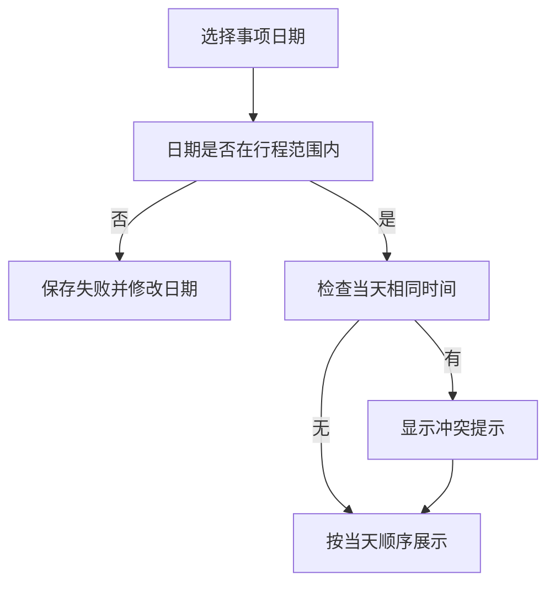
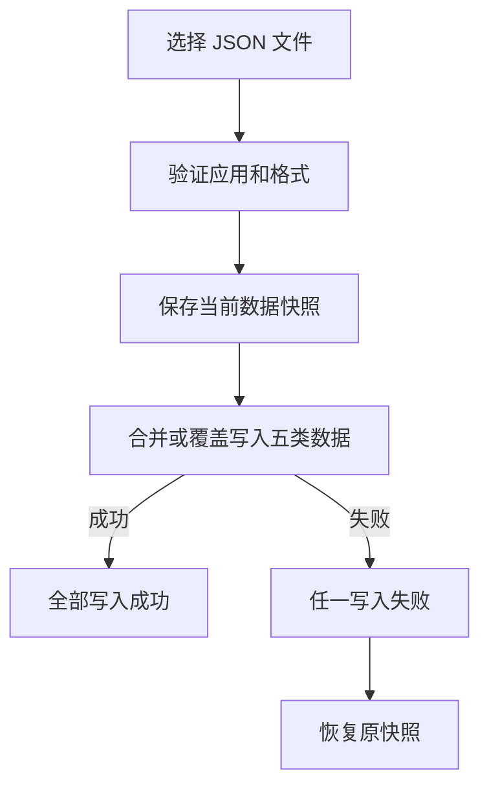

# 日常工具箱用户手册

<!-- 此文件由 scripts/generate-user-guide.js 根据 miniprogram/packages/tools/help/helpContent.js 生成，请勿手工编辑。 -->

> 适用版本：微信小程序纯前端版（备份格式 v1） 
> 更新日期：2026-07-23 
> 本手册与小程序内帮助使用同一份内容源，功能名称和入口保持一致。
> 所有业务数据只保存在当前设备的微信小程序本地空间，重要内容请定期导出备份。

“日常工具箱”把五个常用功能放在同一个离线小程序中：AA 分账、行程安排、通用清单、决策转盘和酒店餐厅快评。五个工具彼此独立，删除其中一个工具的数据不会连带修改其他工具。

本手册按“先上手、再深入、最后保护数据”的顺序介绍完整操作。小程序内可搜索章节、展开步骤，并通过章节底部按钮直达对应工具。

## 目录

1. [快速开始](#section-quick)
2. [AA 分账](#section-ledger)
3. [行程安排](#section-trips)
4. [通用清单](#section-checklists)
5. [决策转盘](#section-wheel)
6. [酒店餐厅快评](#section-records)
7. [本地数据与备份](#section-data)
8. [常见问题](#section-faq)

## 1. 快速开始

先选工具，再保存，再备份

首页只有五个平级工具，右上角提供帮助和数据设置。每个工具都独立保存内容，不需要注册账号。

**功能入口：** 打开小程序后即进入工具箱首页；右上角可打开帮助和数据设置。

**页面直达：** 打开工具箱（`/pages/index/index`）

### 核心路径

`选择工具` → `完成记录` → `定期备份`

### 核心步骤

1. **从首页选择任务：** 分账、排行程、列清单、转转盘或写快评，直接点击对应卡片。
2. **在工具内完成操作：** 各工具会把修改即时写入本地，返回首页后再次进入仍可继续使用。
3. **重要内容及时备份：** 进入数据设置导出完整 JSON 文件，并把文件保存到可靠的位置。

### 使用提醒

- 卸载小程序、清理微信存储或更换设备，都可能导致本地内容不可用。
- 五个工具之间没有关联 ID，可以放心分别新增、编辑和删除。

### 五个工具一览

| 工具 | 适合解决的问题 | 主要结果 |
| --- | --- | --- |
| AA 分账 | 多人同行时记录共同支出 | 每个人最终应付给谁多少钱 |
| 行程安排 | 按日期组织每天的事项 | 有顺序、无时间冲突的日程 |
| 通用清单 | 打包、采购或普通待办 | 多份可排序清单和完成进度 |
| 决策转盘 | 从多个候选项中做决定 | 带动画的随机结果和历史 |
| 酒店餐厅快评 | 快速记住一次住宿或用餐 | 名称、日期、可选评分和一句备注 |

### 离线使用原则

- 不需要登录，打开即可使用。
- 五个工具分别存储，彼此不会自动创建关联。
- 日常新增和编辑不依赖网络。
- 导出的文件需要由用户自行妥善保存。
- 恢复或清空前，建议先导出一份最新备份。

## 2. AA 分账

共同花费记清楚，结算结果算准确

先建立账本和同行人，再记录每笔费用由谁支付、哪些人参与分摊。系统始终使用整数最小货币单位计算，避免浮点误差。

**功能入口：** 首页点击“AA 分账”。

**页面直达：** 打开 AA 分账（`/pages/ledger/index/index`）

### 核心路径

`添加同行人` → `记录支出` → `完成结算`

### 核心步骤

1. **新建账本：** 填写账本名称和币种，再逐个添加同行人。
2. **录入共同支出：** 填写金额、付款人，并勾选实际参与平分的人。
3. **核对余额：** 查看每个人已付、应付和差额，确认遗漏或参与人选择错误。
4. **执行结算：** 按系统建议登记转账，可部分结算、撤销，并导出结算图片或 PDF。

### 使用提醒

- 一笔费用只记录一次；付款人和参与人是两个不同概念。
- 不同币种分开计算，不会自动换算。
- 涉及钱款时，导出前请与同行人共同核对原始支出。

### 建账与添加同行人

1. 点击新建账本，输入容易识别的名称。
2. 确认账本币种。
3. 使用新增同行人操作逐个添加成员。
4. 成员齐全后再录入共同支出。

同行人姓名只用于当前账本。不同账本中的同名成员互不影响，因此可以分别记录不同出行组合。

### 一笔费用怎样分

| 字段 | 含义 | 例子 |
| --- | --- | --- |
| 金额 | 这笔共同费用的总额 | 晚餐 300 元 |
| 付款人 | 实际垫付整笔费用的人 | 小林 |
| 参与人 | 应该承担这笔费用的人 | 小林、小周、小吴 |
| 分摊结果 | 每个参与人应承担的份额 | 每人 100 元 |

### 结算、撤销与导出

- 结算建议会尽量减少转账次数。
- 实际只转了一部分时，按实际金额登记部分结算。
- 登记错误可以撤销，再按正确金额重做。
- 结算图片适合快速发送，PDF 适合保存完整明细。
- 导出结果前应再次检查币种、人员和支出总额。

## 3. 行程安排

只管理日期和每天事项

用目的地、起止日期和按天事项组织一次出行。事项支持排序，时间重复时会给出冲突提示。

**功能入口：** 首页点击“行程安排”。

**页面直达：** 打开行程安排（`/pages/trip/index`）

### 核心路径

`创建行程` → `添加事项` → `检查冲突`

### 核心步骤

1. **填写基础信息：** 设置行程名称、目的地、开始日期和结束日期。
2. **按天添加事项：** 选择行程范围内的日期，可补充时间、标题、位置和备注。
3. **调整当天顺序：** 使用上移、下移或排序操作，把事项排成实际执行顺序。
4. **处理时间冲突：** 同一天相同时间出现多个事项时，根据提示修改时间或确认安排。

### 使用提醒

- 事项日期必须位于行程开始和结束日期之间。
- 未填写具体时间的事项仍可保存，并按手工顺序展示。
- 复制行程会生成独立副本，修改副本不会影响原行程。

### 创建和维护行程

1. 新建行程并填写名称、目的地和日期范围。
2. 进入行程详情，选择某一天新增事项。
3. 填写时间和标题；位置、备注可选。
4. 保存后在当天列表中检查顺序和冲突提示。
5. 需要复用时复制整份行程，再编辑副本。

### 时间与顺序的关系

时间用于发现明显冲突，顺序用于表达当天实际先后。即使两个事项都没有时间，也可以通过调整顺序安排它们。

### 编辑和删除

- 修改日期范围前，先确认现有事项是否仍在新范围内。
- 删除事项只影响当前行程。
- 删除整份行程前会要求确认。
- 行程内容不会自动写入其他工具。

## 4. 通用清单

打包、采购和待办都能记

可创建多份互相独立的清单，从空白开始或套用旅行打包模板。每份清单都有完成进度和可排序项目。

**功能入口：** 首页点击“通用清单”。

**页面直达：** 打开通用清单（`/pages/checklist/index`）

### 核心路径

`创建清单` → `添加项目` → `勾选完成`

### 核心步骤

1. **选择创建方式：** 新建空白清单，或使用旅行打包模板快速生成常用项目。
2. **增删和编辑项目：** 输入项目文字后添加，长按或打开操作菜单可编辑、移动或删除。
3. **跟踪完成进度：** 勾选完成后，顶部进度会同步更新。
4. **维护多份清单：** 在清单选择器中切换，可重命名、清除已完成项目或删除整份清单。

### 使用提醒

- 多次使用旅行模板会新建独立清单，不会重复插入到当前清单。
- 清除已完成项目不可撤销，执行前请确认。
- 给清单使用明确名称，例如“周末采购”或“东京打包”。

### 空白清单与旅行模板

| 创建方式 | 适合场景 | 初始内容 |
| --- | --- | --- |
| 空白清单 | 采购、家务、工作待办等 | 只有标题，项目由用户添加 |
| 旅行打包模板 | 出发前检查随身物品 | 生成一组常用打包项目 |

模板只负责创建初始内容。创建后可自由编辑、移动和删除，不会改变下一次新建模板的默认项目。

### 项目状态和排序

- 上移或下移只改变当前清单中的顺序。
- 取消勾选后，项目会重新计入未完成数量。
- 清除已完成只删除已勾选项目，未完成项目和顺序保留。
- 删除整份清单会同时删除其中所有项目。

## 5. 决策转盘

把候选项交给一次有过程的随机选择

输入多个候选项并保存为转盘，可以点击旋转，也可以用手势拨动。停止后显示结果并写入历史。

**功能入口：** 首页点击“决策转盘”。

**页面直达：** 打开决策转盘（`/packages/tools/wheel/index`）

### 核心路径

`输入选项` → `拨动转盘` → `查看结果`

### 核心步骤

1. **新建或选择转盘：** 为当前决定命名，逐项添加或批量粘贴候选内容。
2. **管理有效选项：** 暂时不参与抽取的选项可以停用，需要时再恢复。
3. **开始旋转：** 点击旋转按钮，或在转盘上做拨动手势触发带减速效果的动画。
4. **查看和复用结果：** 结果会进入历史，可继续旋转、修改选项或切换已保存转盘。

### 使用提醒

- 至少保留两个启用选项，结果才有选择意义。
- 停用不会删除选项，恢复后仍可继续参与。
- 旋转过程中不要连续重复触发，等待指针稳定后再读取结果。

### 准备候选项

- 逐项输入适合少量候选。
- 批量输入适合一次粘贴多行文本。
- 相同文字会让结果难以区分，建议先整理重复项。
- 暂时不需要的选项使用停用，不必删除。
- 多个决定可分别保存为不同转盘。

### 一次完整旋转

最终结果以固定指针指向的扇区为准。转盘主体旋转而页面布局保持稳定，动画结束后才会确认并记录结果。

### 保存、历史和停用

| 操作 | 是否保留内容 | 用途 |
| --- | --- | --- |
| 保存转盘 | 保留名称和选项 | 下次继续使用同一组候选 |
| 停用选项 | 保留选项 | 暂时排除，不参加本次选择 |
| 删除选项 | 不保留 | 永久移除无效候选 |
| 查看历史 | 保留历次结果 | 回看之前抽中的内容 |

## 6. 酒店餐厅快评

用最少字段记住一次到访

快评记录类型、名称、城市、到访日期、可选总分和一句备注，适合在离店或用餐后迅速完成。

**功能入口：** 首页点击“酒店餐厅快评”。

**页面直达：** 打开酒店餐厅快评（`/pages/record/index`）

### 核心路径

`选择类型` → `填写快评` → `保存记录`

### 核心步骤

1. **选择酒店或餐厅：** 从列表页新增，先选择记录类型。
2. **填写核心信息：** 名称必填；城市、日期、1 至 10 分总分和备注按需要填写。
3. **保存或继续编辑：** 保存按钮固定在页面底部，编辑已有记录时会覆盖原记录。
4. **搜索和筛选：** 在列表页按名称、城市或备注搜索，并按酒店或餐厅筛选。

### 使用提醒

- 评分可以留空，列表会明确显示未评分。
- 名称为空或评分超出范围时不会保存，并会显示清晰提示。
- 删除前会二次确认，删除后只能通过先前导出的备份找回。

### 快评字段

| 字段 | 是否必填 | 说明 |
| --- | --- | --- |
| 类型 | 是 | 酒店或餐厅 |
| 名称 | 是 | 酒店名或餐厅名 |
| 城市 | 否 | 便于以后搜索 |
| 到访日期 | 是 | 记录实际住宿或用餐日期 |
| 总分 | 否 | 1 至 10 分，可保留一位小数 |
| 备注 | 否 | 最多用一句话记住重点 |

### 新增、编辑和删除

新增和编辑共用同一表单。编辑保存会保留原记录 ID 和创建时间，只更新内容与修改时间。

### 查找已有记录

- 搜索可匹配名称、城市和备注。
- 类型筛选可只看酒店或只看餐厅。
- 清空搜索后会恢复显示当前类型下的全部记录。
- 评分留空的记录仍会保留在列表中。

## 7. 本地数据与备份

知道数据在哪里，也知道怎样带走

数据设置集中显示本地占用和上次备份时间，并提供完整导出、恢复和清空。备份文件包含五个工具的业务数据。

**功能入口：** 首页右上角点击“数据设置”。

**页面直达：** 打开数据设置（`/packages/tools/data/index`）

### 核心路径

`导出备份` → `验证并恢复` → `失败自动回滚`

### 核心步骤

1. **查看本地状态：** 确认五类数据数量、本地占用和上次成功导出的时间。
2. **导出完整备份：** 生成备份格式 v1 的 JSON 文件，包含快评、行程、清单、AA 账本和转盘。
3. **选择恢复方式：** 导入有效文件后，可合并到现有数据或覆盖恢复。
4. **谨慎清空：** 清空会一次删除五个工具的本地内容，操作前务必确认已有可用备份。

### 使用提醒

- 恢复会先验证文件结构；任何一类写入失败都会回到恢复前状态。
- 覆盖恢复会替换当前五类业务数据，优先使用合并导入。
- 备份文件可能包含姓名、金额和备注，请只存放在可信位置。

### 备份中包含什么

| 集合 | 内容 |
| --- | --- |
| records | 酒店餐厅快评 |
| trips | 行程和按天事项 |
| checklists | 多份清单和清单项目 |
| ledgers | AA 账本、成员、支出与结算 |
| wheels | 已保存转盘、选项和历史 |

备份顶层会标记应用身份和 schemaVersion 1。导入时会先检查版本、集合类型和重复 ID，再开始写入。

### 安全恢复流程

- 合并导入：保留现有内容，并加入备份中的内容。
- 覆盖恢复：以备份文件替换当前五类数据。
- 格式非法：停止导入，不修改当前数据。
- 写入失败：使用开始前的快照回滚全部数据。

### 清空前检查

1. 先导出最新完整备份。
2. 确认文件可以在文件管理中找到。
3. 核对数据设置中显示的五类数量。
4. 阅读二次确认提示后再执行清空。
5. 清空后重新进入各工具检查空状态。

## 8. 常见问题

离线工具最需要知道的几件事

遇到问题时，先确认当前工具、输入内容和最近一次备份状态。五个工具彼此独立，可以分别排查。

**功能入口：** 在小程序内帮助页搜索关键词，或从章节导航进入“问答”。

### 核心路径

`确认现象` → `检查输入` → `核对备份`

### 高频问题

#### 为什么换设备后没有数据？

内容只保存在原设备本地。需要先从原设备导出，再在新设备恢复。

#### 为什么 AA 结果和预期不同？

逐笔检查金额、币种、付款人和参与人，尤其确认没有重复录入。

#### 为什么行程事项不能保存？

确认事项日期位于行程范围内，时间格式有效，并处理页面提示的问题。

#### 为什么恢复失败？

确认选择的是本工具箱导出的格式 v1 JSON 文件，并且文件没有被手工改坏。

### 使用提醒

- 发现异常时先停止继续修改，并导出当前数据留存。
- 清空数据不能撤销，只能从此前备份恢复。
- 导出文件包含个人内容，不要随意转发。

### 数据与设备

#### 关闭微信后内容还在吗？

正常关闭不会主动删除本地内容。再次进入工具时会从本地读取；仍建议定期导出备份。

#### 换设备怎样继续使用？

在原设备导出完整备份，把 JSON 文件转移到新设备，再从数据设置中恢复。

#### 导入失败会不会破坏现有内容？

不会。文件会先验证，写入前也会保存快照；任一集合写入失败时会回滚。

#### 清空后还能撤销吗？

不能直接撤销。只有在清空前已经导出有效备份时，才能通过恢复找回。

### 功能排查

#### AA 金额为什么会相差一分钱？

金额不能整除时必须分配最小单位尾差。系统保证所有参与人的份额总和等于原始金额。

#### 行程为什么提示时间冲突？

同一天存在相同时间的多个事项。可以修改时间，也可以保留并根据当天顺序执行。

#### 转盘为什么不能开始？

检查是否至少有两个启用选项，并等待上一轮动画完全结束。

#### 快评为什么保存失败？

名称不能为空；填写评分时需在 1 至 10 之间。根据页面提示修正后再保存。

---

开发、调试、数据结构和自动化测试说明请阅读项目根目录的 [README](../README.md)。
