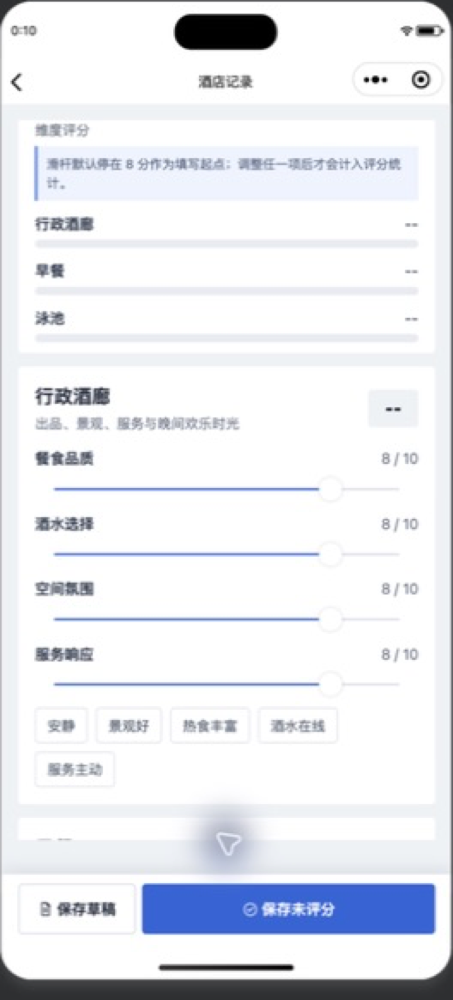
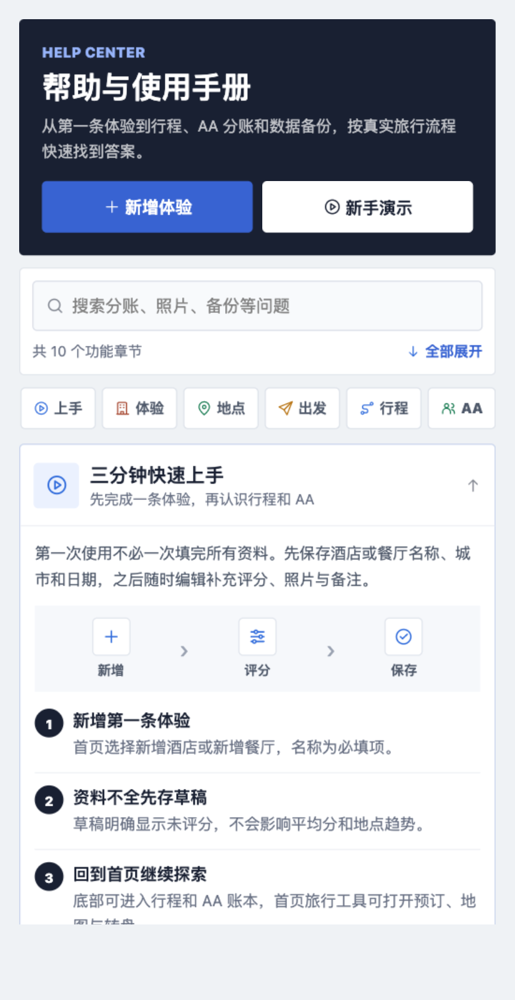
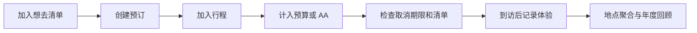
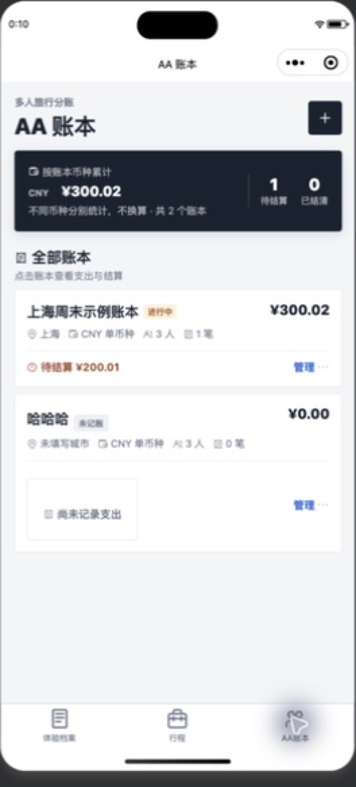
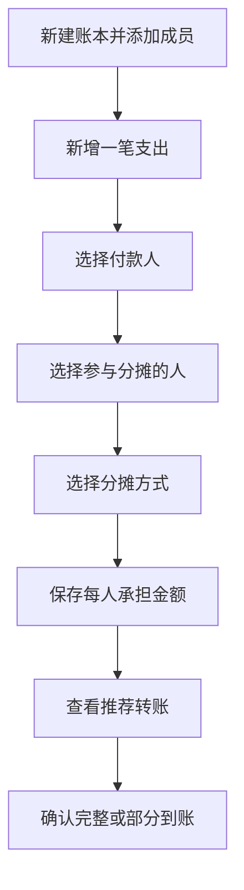
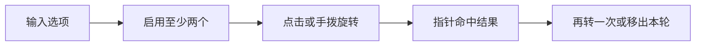
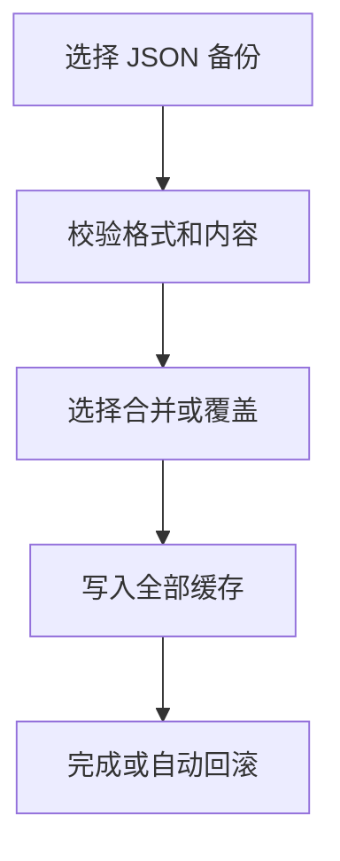

# 体验档案小程序用户手册

<!-- 此文件由 scripts/generate-user-guide.js 根据 miniprogram/packages/tools/help/helpContent.js 生成，请勿手工编辑。 -->

> 适用版本：本地优先纯前端版（数据备份格式 v9）<br>
> 更新日期：2026-07-16<br>
> 本手册中的截图使用演示数据，名称、金额和日期仅用于说明操作。

“体验档案”用于管理旅行中的酒店、餐厅、预订、行程、预算和多人 AA 账本。当前版本不需要注册账号，也不连接后端；内容默认保存在微信小程序本地缓存中。

普通用户可在小程序首页右上角点击“手册”，打开适合手机阅读的十章帮助中心；本文档由同一份帮助内容自动生成，保留更完整的图文说明。

## 目录

1. [三分钟快速上手](#section-quick)
2. [酒店与餐厅体验](#section-records)
3. [地点与想去清单](#section-places)
4. [预订与出发中心](#section-departure)
5. [行程与预算中心](#section-trips)
6. [AA 账本精确分账](#section-ledger)
7. [决策转盘](#section-wheel)
8. [地图、洞察与回忆](#section-review)
9. [备份、恢复与隐私](#section-data)
10. [常见问题](#section-faq)

<a id="section-quick"></a>
## 1. 三分钟快速上手

先完成一条体验，再认识行程和 AA

第一次使用不必一次填完所有资料。先保存酒店或餐厅名称、城市和日期，之后随时编辑补充评分、照片与备注。

**功能入口：** 首页点击“新增酒店”或“新增餐厅”；首页右上角“手册”可随时返回帮助中心。

**页面直达：** 开始新手演示（`/packages/tools/demo/index`）

### 核心路径

`新增` → `评分` → `保存`

### 核心步骤

1. **新增第一条体验：** 首页选择新增酒店或新增餐厅，名称为必填项。
2. **资料不全先存草稿：** 草稿明确显示未评分，不会影响平均分和地点趋势。
3. **回到首页继续探索：** 底部可进入行程和 AA 账本，首页旅行工具可打开预订、地图与转盘。

### 使用提醒

- 首页右上角的手册入口会一直保留。
- 想边看边练习，可打开新手演示；演示不会覆盖个人数据。

### 先认识三个主入口

| 入口 | 适合做什么 |
| --- | --- |
| 体验档案 | 记录酒店和餐厅、管理地点与想去清单、进入出发中心和旅行工具 |
| 行程 | 按日期规划旅行、安排日程、管理总预算与个人支出 |
| AA 账本 | 管理同行人、记录共同支出、自动算出谁应给谁多少钱 |

<p align="center">
  
</p>

<p align="center"><em>首页按概览、继续记录、旅行工具和我的档案分区。</em></p>

首页顶部显示已完成体验数、去过的城市数和个人平均评分。中部可快速新增酒店、餐厅或未评分草稿；“最近使用”用于回到刚才查看的体验或账本；“旅行工具”包含出发中心、地图、决策转盘、想去清单、洞察、回忆册、数据管理等入口。

| 我的档案视图 | 用途 |
| --- | --- |
| 记录 | 查看每一次入住或用餐记录 |
| 地点 | 把同一家酒店或餐厅的多次到访聚合起来 |
| 想去 | 管理想去、已预订、已到访的计划 |
| 时间线 | 按日期回顾旅行经历 |
| 城市 | 查看各城市的体验数量和评分 |
| 标签 | 按“适合亲子”“纪念日”等自定义标签归档 |

### 完成第一条体验

1. 在“体验档案”首页点击“新增酒店”或“新增餐厅”。
2. 填写名称、城市和到访日期。
3. 根据类型完成评分，可补充标签、照片和备注。
4. 点击保存，返回首页后查看统计和记录卡片。

名称是必填项。资料暂时不完整时，可选择“快速记录”或保存草稿；草稿会明确显示“未评分”，不会用默认分数影响首页和地点统计。

新增和编辑时，保存操作始终固定在页面底部；表单可独立滚动，最后一项内容不会被操作栏遮挡。

<p align="center">
  
</p>

<p align="center"><em>无论表单滚动到哪里，都可以立即保存草稿或保存记录。</em></p>

### 使用新手演示

首页的“新手演示”会准备一组独立示例数据，并通过四个任务带你依次体验主要功能。

1. 查看酒店或餐厅体验。
2. 查看旅行行程。
3. 查看三人 AA 分账。
4. 使用决策转盘。

演示任务只有在目标页面成功打开后才会计为完成。中途退出后可从首页继续、重新开始或退出；退出演示只删除由演示登记的数据，不会覆盖或清理个人记录。

<p align="center">
  
</p>

<p align="center"><em>帮助中心支持搜索口语关键词、章节定位、展开收起和功能直达。</em></p>

### 推荐工作流



这是功能最完整的正式旅行路径。想去项、预订、行程、预算和体验之间通过 ID 关联，重复执行已有动作时会尽量打开原内容，不会重复创建。

- 旅行结束后补录：先快速保存名称、城市和日期，回家后再补评分、照片、标签和备注。
- 多人旅行记账：出发前建立 AA 账本；每笔共同费用只记录一次，并准确选择付款人与参与人；结束后统一结算。
- 定期维护：处理重复地点和长期草稿，检查行程、预订与 AA 状态，导出完整 JSON，并另外保存照片原图。

<a id="section-records"></a>
## 2. 酒店与餐厅体验

评分、照片、标签、备注和多次到访

酒店记录行政酒廊、早餐和泳池；餐厅记录菜品、服务、饮品和环境。已完成且已评分的记录才会进入个人均分。

**功能入口：** 首页点击“新增酒店”或“新增餐厅”；查看已有记录时，从首页“我的档案”中的记录卡片进入详情。

**页面直达：** 新增体验（`/pages/record/record?type=hotel`）

### 核心路径

`选类型` → `补细节` → `进档案`

### 核心步骤

1. **填写基础信息：** 记录名称、城市、日期；酒店可填房型和会员，餐厅可填菜系与米其林等级。
2. **完成评分与标签：** 评分滑块显示 8 分起点，但只有实际调整过评分项才会标记为已评分；之后自动计算分类分、总分和结论。
3. **管理照片与备注：** 每条体验最多 9 张照片，可分类、写说明、排序并设置封面。
4. **后续维护：** 详情页支持编辑、复制、删除和生成照片回顾；编辑不会新增重复记录。

### 使用提醒

- 快速记录会保存为未评分草稿。
- 分享摘要与私密备注分开保存，脱敏分享预览默认隐藏敏感字段。

### 酒店记录

- 基础信息：酒店名、城市或地区、地址、入住日期、房型、会员等级。
- 三大评分：行政酒廊、早餐、泳池，以及各自细项。
- 补充内容：自定义标签、分享摘要、私密备注、照片。
- 地点关系：关联已有地点，或明确创建新地点。
- 行程关系：从行程、想去项或预订进入时，自动带入可复用信息。

评分滑块的 8 分只是方便录入的起点，不代表系统已经替用户评分。只有实际调整过评分项并保存为已完成后，记录才进入首页均分和地点趋势。

### 餐厅记录

- 餐厅名、城市或地区、地址、到访日期、菜系、餐次和人均价格。
- 米其林等级。
- 菜品、服务、酒水或饮品、环境评分及细项。
- 标签、分享摘要、私密备注和照片。

酒店与餐厅使用不同评分结构，但搜索、地点关联、照片、草稿和导出方式一致。

### 查看、编辑、复制与删除

点击首页任意记录即可进入详情页。详情页展示基础资料、总分、分类评分、标签、备注、照片和关联地点。

<p align="center">
  
</p>

<p align="center"><em>体验详情会把总分、结论和各分类评分放在最容易扫读的位置。</em></p>

- 编辑：覆盖原记录并更新修改时间，不会新增重复记录。
- 复制：保留内容进入新增页，生成新的记录 ID 和创建时间，适合二刷或再次入住。
- 删除：二次确认后删除当前体验；关联地点不会因此被静默删除。
- 再次入住或再次用餐：从地点详情创建新体验，并带入地点、名称、城市和地址。

编辑页修改内容后直接返回，会出现未保存提醒。保存、确认放弃或删除后，提醒会自动解除。

### 照片、封面与故事

- 从相册选择或拍照。
- 为照片选择分类并填写说明。
- 调整顺序并指定封面。
- 从单条体验选择最多 6 张照片生成故事长图。

照片保存在小程序本地持久目录。若系统清理了文件，页面会显示失效占位；JSON 备份只保存照片路径与说明，不包含照片二进制，因此跨设备恢复不能自动带回原图。

### 搜索、筛选和排序

首页搜索可匹配名称、城市、备注、标签、菜系、米其林等级、房型和会员等级。

- 类型：全部、酒店、餐厅。
- 状态：全部、已完成、草稿。
- 排序：最近创建、日期最新、评分最高、评分最低。
- 标签：从标签视图继续筛选。

筛选条件会同步影响记录、地点、时间线、城市和标签统计。找不到结果时可一键清除条件，不会误导用户重新创建内容。

<a id="section-places"></a>
## 3. 地点与想去清单

把同一家店的多次到访聚合起来

一次入住或用餐是一条体验，同一家酒店或餐厅是一个地点。地点页汇总到访次数、均分、最高分和评分变化。

**功能入口：** 首页“我的档案”切换到“地点”或“想去”；也可从“旅行工具”进入想去清单和旅行地图。

**页面直达：** 新增想去地点（`/pages/wishlist/edit?type=hotel`）

### 核心路径

`想去` → `关联地点` → `已到访`

### 核心步骤

1. **确认地点建议：** 系统只提供相似候选，必须由你选择关联已有地点或创建新地点。
2. **管理多次到访：** 从地点详情再次入住或再次用餐，会自动带入名称、城市和地址。
3. **处理重复地点：** 确认重复后可手动合并；有关联记录的地点不能直接删除。
4. **管理想去状态：** 想去项可在想去、已预订、已到访之间流转，并可继续创建预订或加入行程。

### 使用提醒

- 地图位置是可选信息，拒绝授权后仍可手工保存。
- 地点改名不会篡改历史体验中的名称快照。

### 地点与多次到访

“记录”代表一次具体入住或用餐，“地点”代表现实中的同一家酒店或餐厅。多次到访关联到同一地点后，地点详情会汇总以下内容。

- 到访次数、个人平均分和最高分。
- 最近一次评分和评分变化趋势。
- 按日期排列的全部到访记录。
- 城市、地区、地址和可选地图位置。

新增体验时，系统只在相同类型中查找名称完全一致、别名一致或名称互相包含的地点，并把同城候选排在前面。你必须明确选择关联已有地点或创建新地点，系统不会按名称静默合并。

地点改名不会改写历史体验中的名称快照。发现重复地点时，可从地点详情手动合并；来源地点的记录会转移到目标地点，旧名称会加入别名。仍有关联记录的地点不能直接删除。

### 地图位置

编辑地点或体验时，可以使用微信的“选择位置”填写名称、地址和经纬度。拒绝位置授权或选择失败时，仍可手工填写名称、城市、地区和地址并正常保存。

- 旅行地图聚合有坐标的已到访酒店和餐厅。
- 地图同时显示想去清单中有坐标的项目。
- 缺少坐标的内容会单独列出，不会从档案消失。
- 查看个人旅行地图不需要读取当前位置。

### 想去清单

想去项支持想去、已预订、已到访三种状态，并可填写优先级、目标日期、预算、预订编号、同行人、参考链接和计划备注。

- 创建预订，并回写“已预订”、日期和预订编号。
- 加入指定行程。
- 记录到访并带入地点信息；体验真正保存成功后才标记为“已到访”。
- 按名称、类型、状态和优先级搜索筛选。

发现相似地点时同样需要用户确认，不会自动合并。

<a id="section-departure"></a>
## 4. 预订与出发中心

集中管理取消期限、付款和行前清单

住宿、餐厅、交通、门票和其他预订统一放在出发中心。免费取消期限临近时会提高提示优先级。

**功能入口：** 首页展开“旅行工具”，点击“出发中心”；也可从想去项继续创建预订。

**页面直达：** 打开出发中心（`/pages/departure/index`）

### 核心路径

`计划` → `预订` → `清单`

### 核心步骤

1. **新增预订：** 填写日期时间、人数、金额、付款状态、预订编号与免费取消截止时间。
2. **接入旅行流程：** 预订可加入行程、计入预算、预填 AA 支出，酒店和餐厅到访后还能直接创建体验。
3. **完成行前清单：** 清单可绑定行程或保存在通用清单，任务支持负责人、完成状态和备注。

### 使用提醒

- 重复加入行程或预算时会打开既有内容，不会重复创建。
- 删除预订不会静默删除已关联的行程或支出。

### 出发中心概览

出发中心统一管理住宿、餐厅、交通、门票和其他预订，也负责行前清单。

<p align="center">
  
</p>

<p align="center"><em>顶部先提示待出发数量、取消期限和清单完成进度，再展示预订。</em></p>

### 新增与查看预订

- 类型、名称、城市、地址。
- 开始与结束日期、具体时间。
- 人数、金额、币种、付款状态。
- 预订编号、取消政策、免费取消日期和具体截止时间。
- 关联的想去项、地点、行程、预算支出、AA 账本和体验记录。

取消截止时间临近 72 小时和 24 小时时，页面会提高提示优先级；已经过期时会明确标记。编辑预订后直接返回会触发未保存提醒。

<p align="center">
  
</p>

<p align="center"><em>预订详情集中展示日期、付款与取消信息，并提供四个后续动作。</em></p>

### 把预订接入旅行流程

| 操作 | 结果 |
| --- | --- |
| 加入行程 | 自动带入日期、时间、地点、金额和预订编号；重复操作不会重复创建日程 |
| 计入预算 | 生成一条关联的行程个人支出，并防止重复计入 |
| 加入 AA | 预填支出名称、金额、分类和日期；付款人、参与人和分摊方式仍需确认 |
| 记录体验 | 酒店或餐厅到访后创建体验，带入名称、日期、地点和关联信息 |

删除预订不会静默删除已关联的行程、支出或体验，避免误伤其他数据。

### 行前清单

清单可以绑定具体行程，也可以保存在“通用清单”。内置模板包含证件、预订确认、通讯、保险、药品和充电设备等事项。

- 重复补齐模板不会生成重复任务。
- 每项任务可设置负责人、完成状态和备注。
- 任务支持编辑和删除。
- 出发中心会汇总整体完成进度。

<a id="section-trips"></a>
## 5. 行程与预算中心

按天安排，并分清个人支出和共同支出

行程支持多个城市、日期、本位币、总预算、分类预算和按天日程。时间冲突会在日程中明确提示。

**功能入口：** 底部导航点击“行程”；从想去项或预订详情也可把内容加入指定行程。

**页面直达：** 查看我的行程（`/pages/trip/index`，底部导航页）

### 核心路径

`定日期` → `排日程` → `看预算`

### 核心步骤

1. **建立行程：** 填写名称、城市、起止日期和预算，行程列表会显示状态、进度与摘要。
2. **安排每日时间线：** 日程可编辑、排序、移动、复制单条或整天，并限制在行程日期内。
3. **记录个人支出：** 预算中心中的个人费用单独保存，支持外币和固定汇率。
4. **关联 AA 账本：** 共同支出从同币种账本实时读取，不复制费用；异币种账本会被明确拦截或忽略。

### 使用提醒

- 复制整段行程会保留结构和预算，但清空实际支出与到访结果。
- 删除行程前会列出仍需处理的日程和关联数据。

### 建立行程

“行程”入口按进行中、即将开始、已结束和已归档组织旅行。新建时可设置以下内容。

- 行程名、一个或多个城市。
- 开始和结束日期。
- 本位币、总预算和分类预算。
- 备注与归档状态。

<p align="center">
  
</p>

<p align="center"><em>行程卡同时展示日期、日程数量、状态、完成度和预算摘要。</em></p>

### 安排每日时间线

进入行程后，可按天新增酒店、餐厅、交通、景点或其他日程。每项日程可填写时间、名称、地点、金额、备注和关联体验。

<p align="center">
  
</p>

<p align="center"><em>日程按天分组，可直接编辑、复制本日或从底部继续添加。</em></p>

- 点击已有日程编辑。
- 同一天内上下调整顺序。
- 复制单条日程或复制整天安排。
- 移动到行程范围内的其他日期。
- 时间重叠时显示冲突提醒。

复制整段行程时会保留日程结构和预算设置，但会清空实际支出、关联账本和到访记录，适合复用旅行模板。

### 预算中心

点击行程顶部“预算”进入预算中心。

<p align="center">
  
</p>

<p align="center"><em>预算中心把个人支出和关联 AA 账本分开显示，再汇总到分类进度。</em></p>

1. 个人支出：直接在预算中心新增，可编辑、删除，日期必须位于行程范围内。
2. AA 账本：只实时读取与行程本位币一致的所选账本，不复制数据，也不自动换算。

这种设计可避免同一笔费用既记在 AA 账本、又被复制成个人支出而重复统计。个人外币支出可填写原币、固定汇率和日期，折算为行程本位币；AA 账本坚持单账本单币种，不做隐式汇率换算。

<a id="section-ledger"></a>
## 6. AA 账本精确分账

记录谁付款、谁参与，自动生成转账建议

每笔支出先选择付款人，再选择真正参与分摊的人。每个账本只使用一种本位币，金额按最小计账单位计算，所有人的应摊合计严格等于原支出。

**功能入口：** 底部导航点击“AA 账本”；预订详情中的“加入 AA”可预填一笔共同支出。

**页面直达：** 打开 AA 账本（`/pages/ledger/index/index`，底部导航页）

### 核心路径

`加成员` → `记支出` → `去结算`

### 核心步骤

1. **维护同行人：** 成员使用稳定 ID，改名不影响历史归属；有历史记录的成员只能归档。
2. **选择分摊方式：** 支持人均、固定金额、百分比和份数，也可只让部分成员参与。
3. **核对成员净额：** 正数表示应收，负数表示应付；系统自动生成尽量精简的转账方案。
4. **确认实际到账：** 支持部分或完整转账，确认后重新计算剩余金额，也可撤销并保留历史。

### 使用提醒

- 支持 CNY、USD、EUR、JPY、HKD 和 GBP；同一账本不混合币种。
- 分享给同行人时优先使用匿名 PDF 或结算图片。

### 账本概览

AA 账本用于解决“谁先付了多少钱、这笔钱由哪些人承担、最后谁应给谁多少钱”。创建时选择一种本位币，账内所有支出、分摊和转账都使用该币种；列表与年度汇总也会按币种分开显示。

<p align="center">
  
</p>

<p align="center"><em>AA 首页先展示累计支出与待结算状态，再进入具体账本处理费用。</em></p>



### 新建账本和成员

在底部点击“AA 账本”，再点击“新建”。填写账本名称、目的地、日期、本位币和备注，然后逐个新增同行人。已有金额后修改币种只会更改显示标签，不会自动换算，页面会要求再次确认。

成员使用稳定 ID 保存：成员改名不会改变历史支出归属。已经出现在支出或转账历史中的成员不能被静默删除，但可以归档；归档后不会默认参与新支出。

### 记录支出

- 支出名称、金额、分类和日期。
- 实际付款人。
- 参与分摊的人，可以只选同行人中的一部分。
- 分摊方式及对应数值。
- 可选私密备注。

| 方式 | 适合场景 | 校验规则 |
| --- | --- | --- |
| 人均 | 大家平均承担 | 尾差按稳定成员顺序分配 |
| 固定金额 | 每人承担金额已知 | 合计必须等于支出金额 |
| 百分比 | 按约定比例承担 | 合计必须为 100% |
| 份数 | 儿童半份、不同房型等 | 每人的份数必须是正整数 |

例如三人平均分摊 300.02 元，系统会固化为 100.01、100.01、100.00 元，三人的承担金额严格相加为 300.02 元，不会丢失两分钱。

### 看懂成员净额

```text
净额 = 已付金额 - 应承担金额 - 已转出金额 + 已收到金额
```

- 净额为正：这个人先垫付较多，应收回钱。
- 净额为负：这个人承担不足，应向别人转账。
- 所有人净额之和始终为 0。

“结算”页会自动生成尽量精简的推荐转账方案。实际到账时可以确认完整金额，也可以输入部分金额；系统随后按剩余余额重新计算建议。已确认的转账可以撤销，并保留历史记录。

### 导出结算结果

- 结算图片，适合发到同行群里。
- 私人 PDF，保留真实成员和完整金额。
- 匿名分享 PDF，稳定匿名化成员名称并隐藏私密备注。
- 完整明细 JSON，便于备份和机器读取。

导出前请再次确认所选隐私模式，尤其不要把私人版误发到公开渠道。

<a id="section-wheel"></a>
## 7. 决策转盘

输入多个选项，点击或手拨做决定

一个转盘可保存 2 至 50 个等概率选项。选项支持编辑、排序、临时停用和移出本轮。

**功能入口：** 首页展开“旅行工具”，点击“决策转盘”。

**页面直达：** 打开决策转盘（`/packages/tools/wheel/index`）

### 核心路径

`输选项` → `转一转` → `再决定`

### 核心步骤

1. **批量加入选项：** 每行输入一个选项，至少启用两个选项后才可旋转。
2. **开始旋转：** 可点击按钮，也可直接用手拨动；固定指针决定最终结果。
3. **处理结果：** 抽中后可再转一次或移出本轮，每个转盘保留最近 50 条历史。

### 使用提醒

- 动画只旋转转盘，页面主体不会抖动。
- 多个转盘和抽取历史都会进入完整备份。

### 准备选项

1. 新建转盘或选择已有转盘。
2. 在批量输入区每行输入一个选项。
3. 添加后可编辑名称、调整顺序、临时停用或删除选项。
4. 至少启用两个选项后才能旋转。

### 开始旋转与处理结果

可以点击旋转按钮，也可以直接用手拨动转盘。转盘按真实手势速度进行惯性衰减，固定指针决定最终命中的扇区。



动画只作用于转盘 canvas，页面主体不会跟着抖动，也不会触发设备震动。每个转盘最多保留最近 50 条抽取历史，并会包含在完整 JSON 备份中。

<a id="section-review"></a>
## 8. 地图、洞察与回忆

从记录生成个人旅行视角

旅行工具会基于个人档案生成地图、年度洞察、照片故事和年度回忆册，不需要公开数据。

**功能入口：** 首页展开“旅行工具”，进入旅行地图、旅行洞察、年度回忆册或待整理中心；照片故事从体验详情创建。

**页面直达：** 打开旅行洞察（`/packages/tools/insights/index`）

### 核心路径

`看足迹` → `看趋势` → `做回忆`

### 核心步骤

1. **旅行地图：** 聚合已到访和想去地点，缺少坐标的内容会单独列出。
2. **旅行洞察：** 按年份查看最佳体验、城市、标签、评分轨迹和复访变化。
3. **照片故事：** 从单条体验选择最多 6 张照片，生成可分享长图。
4. **年度回忆册：** 按月份整理年度体验，可生成分享长图或私人多页 PDF。

### 使用提醒

- 回忆册分享长图不包含 AA 金额。
- 私人回忆册 PDF 可选择加入年度 AA 聚合金额，但不展示成员明细。

### 回顾工具

| 工具 | 内容 |
| --- | --- |
| 旅行洞察 | 按年份查看酒店或餐厅构成、个人最佳、月度频次、评分轨迹、常去城市、常用标签和复访变化 |
| 旅行地图 | 聚合已到访地点和想去项，按类型和状态筛选，并列出缺少坐标的内容 |
| 照片故事 | 从一条体验选择最多 6 张照片，调整版式、顺序和分享字段，生成长图 |
| 年度回忆册 | 按月份整理体验和年度最佳，最多选择 24 张照片，生成分享长图或私人多页 PDF |
| 待整理中心 | 检查疑似重复地点、资料缺失、孤立记录、未评分内容、长期草稿、重复想去项和失效照片 |

年度回忆册的分享长图不包含 AA 金额。私人 PDF 可以选择加入年度 AA 聚合金额，但不会输出成员或支出明细。

待整理中心中的合并地点、删除照片和清理文件等操作均需要确认。无主照片只从应用自身的媒体登记表识别，不会把 PDF 或其他文件误判为照片。

<a id="section-data"></a>
## 9. 备份、恢复与隐私

本地数据需要主动备份

当前版本没有账号和云同步。重要旅行结束后、更换设备前或清理微信缓存前，请导出完整 JSON 备份。

**功能入口：** 首页展开“旅行工具”，点击“数据管理”。

**页面直达：** 打开数据管理（`/packages/tools/data/index`）

### 核心路径

`本地数据` → `导出备份` → `校验恢复`

### 核心步骤

1. **导出完整备份：** v9 备份包含体验、地点、想去、行程、预订、清单、AA、转盘、模板和偏好。
2. **选择恢复方式：** 合并导入会保留现有数据；覆盖导入会先列出影响范围。
3. **理解照片边界：** JSON 只保存照片路径与说明，不包含图片二进制，跨设备不会自动带回照片。
4. **选择隐私版本：** 私人版用于个人归档；脱敏版隐藏精确日期、价格、等级、私密备注和成员姓名。

### 使用提醒

- 恢复任一缓存失败时会自动回滚，避免只恢复一半。
- 卸载小程序或清理本地数据可能造成内容丢失。

### 完整 JSON 备份

当前备份格式为 `schemaVersion: 9`，包含以下结构化数据。

- 酒店和餐厅体验、地点、想去清单。
- 行程、个人预算、表单模板。
- AA 账本、成员、支出和结算记录。
- 决策转盘和抽取历史。
- 预订、行前清单和部分导出偏好。

备份不包含照片二进制，只保存照片路径、分类和说明。

### 恢复方式

- 合并导入：保留当前数据，跳过已存在的内容；发生 ID 冲突时稳定重映射关联字段。
- 覆盖导入：用备份替换当前相关缓存，执行前会明确列出影响范围。

系统兼容 v1 至 v8 旧备份。恢复会统一写入多个本地缓存；任一写入失败时自动回滚到导入前快照，避免只恢复一半。



### 私人版与脱敏版

| 模式 | 适合用途 | 处理方式 |
| --- | --- | --- |
| 私人版 | 自己保存、完整归档 | 保留更完整的日期、会员、价格和备注 |
| 脱敏版 | 发给朋友或公开展示 | 日期降为月份，隐藏会员等级、价格、私密备注、真实成员名、精确地址和经纬度 |

脱敏分享预览以及将来接入后端时的公开载荷，默认不包含精确地址、经纬度、设备 ID、内部同步 ID、本地照片路径或私密备注。当前版本不会把这些内容发布到网络。

### 本地数据边界

- 卸载小程序、清理小程序数据或系统回收文件可能导致本地内容丢失。
- 在另一台设备登录同一微信，不代表数据会自动出现。
- JSON 备份可恢复结构化数据，但照片需要另外保管原图。
- 选择地图位置需要微信位置权限；拒绝后仍可手工录入。

<a id="section-faq"></a>
## 10. 常见问题

遇到统计、地点、照片或金额问题时先看这里

以下问题覆盖最容易产生疑问的行为。仍无法解决时，先导出完整备份，再进行清理或覆盖恢复。

**功能入口：** 首页右上角点击“手册”，搜索问题关键词或跳转到“问答”章节。

### 核心路径

`找问题` → `看原因` → `再处理`

### 高频问题

#### 为什么草稿没有分数？

草稿不会进入均分。补齐评分并保存为已完成后才参与统计。

#### 为什么同名地点没有自动合并？

同名可能是不同分店或城市，系统只给建议，必须由用户确认。

#### 为什么均分后有人多一个最小单位？

金额无法整除时，尾差按稳定成员顺序分配，总额始终守恒。

#### 为什么恢复后没有照片？

跨设备恢复只有照片元数据，没有原图文件，需要重新添加。

#### 拒绝位置权限还能保存吗？

可以。地图是可选增强，名称、城市、地区和地址都能手工填写。

### 使用提醒

- 涉及金额时，以账本中固化的每人承担金额和结算历史为准。
- 任何覆盖导入或清理前，都建议先保存一份新备份。

### 更多问题

#### 修改地点名称后，旧记录为什么还是旧名称？

体验保存的是当次到访的名称快照。地点改名只影响地点档案，不会篡改历史记录。

#### 行程预算为什么和 AA 总额不同？

预算中心只统计当前行程选中且与行程本位币一致的 AA 账本，并将其与个人支出分开。异币种账本不会被直接相加。还请检查同一费用是否又被手工记成个人支出。

#### 删除成员按钮为什么不可用？

该成员已经出现在历史支出或转账中。为保证账目可追溯，只能将其归档，不能静默删除。

#### PDF 中文会乱码吗？

报告先在隐藏 canvas 中绘制中文页面，再把页面图片封装为 PDF，从而避免依赖 PDF 中文字体。生成后会写入小程序用户目录并打开预览。

#### 数据会自动同步到另一台手机吗？

不会。当前版本是本地优先纯前端应用，没有账号和云同步。请使用完整 JSON 备份保存结构化数据，并单独保存照片原图。

---

如需开发、调试、数据结构和自动化测试说明，请返回项目根目录阅读 [README](../README.md)。
