# 体验档案小程序用户手册

> 适用版本：本地优先纯前端版（数据备份格式 v9）<br>
> 更新日期：2026-07-15<br>
> 本手册中的截图使用演示数据，名称、金额和日期仅用于说明操作。

“体验档案”用于管理旅行中的酒店、餐厅、预订、行程、预算和多人 AA 账本。当前版本不需要注册账号，也不连接后端；内容默认保存在微信小程序本地缓存中。

## 目录

1. [先认识三个主入口](#1-先认识三个主入口)
2. [三分钟快速上手](#2-三分钟快速上手)
3. [记录酒店与餐厅体验](#3-记录酒店与餐厅体验)
4. [管理地点与想去清单](#4-管理地点与想去清单)
5. [用出发中心管理预订](#5-用出发中心管理预订)
6. [规划行程与预算](#6-规划行程与预算)
7. [使用 AA 账本精确分账](#7-使用-aa-账本精确分账)
8. [用决策转盘做选择](#8-用决策转盘做选择)
9. [回顾旅行与生成作品](#9-回顾旅行与生成作品)
10. [备份、恢复与隐私导出](#10-备份恢复与隐私导出)
11. [使用新手演示](#11-使用新手演示)
12. [推荐工作流](#12-推荐工作流)
13. [常见问题](#13-常见问题)

## 1. 先认识三个主入口

小程序底部固定保留三个入口：

| 入口 | 适合做什么 |
| --- | --- |
| 体验档案 | 记录酒店和餐厅、管理地点与想去清单、进入出发中心和旅行工具 |
| 行程 | 按日期规划旅行、安排日程、管理总预算与个人支出 |
| AA 账本 | 管理同行人、记录共同支出、自动算出谁应给谁多少钱 |

<p align="center">
  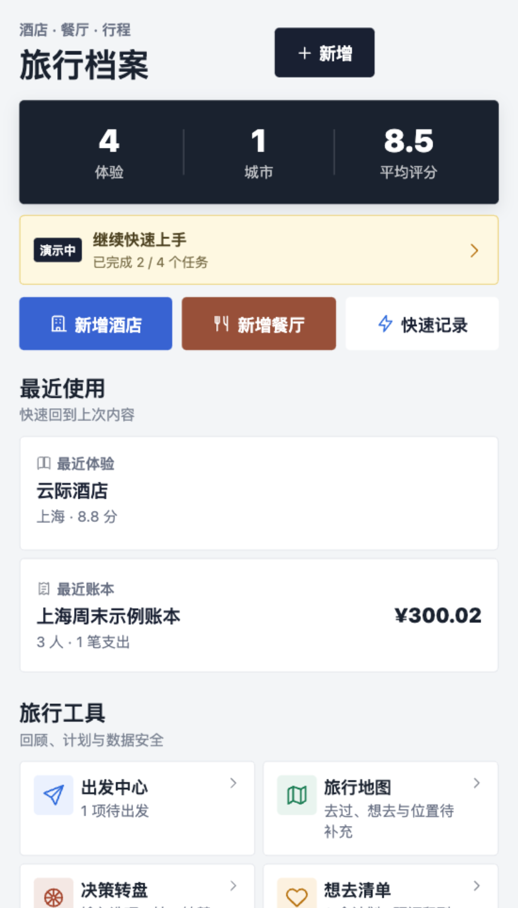
</p>

<p align="center"><em>首页按概览、继续记录、旅行工具和我的档案分区。</em></p>

首页顶部显示已完成体验数、去过的城市数和个人平均评分。中部可快速新增酒店、餐厅或未评分草稿；“最近使用”用于回到刚才查看的体验或账本；“旅行工具”包含出发中心、地图、决策转盘、想去清单、洞察、回忆册、数据管理等入口。

“我的档案”提供六种查看方式：

| 视图 | 用途 |
| --- | --- |
| 记录 | 查看每一次入住或用餐记录 |
| 地点 | 把同一家酒店或餐厅的多次到访聚合起来 |
| 想去 | 管理想去、已预订、已到访的计划 |
| 时间线 | 按日期回顾旅行经历 |
| 城市 | 查看各城市的体验数量和评分 |
| 标签 | 按“适合亲子”“纪念日”等自定义标签归档 |

## 2. 三分钟快速上手

第一次使用时，建议先完成一条酒店或餐厅记录，再创建一个行程或 AA 账本。

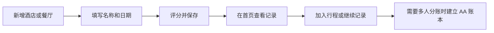

### 2.1 完成第一条体验

1. 在“体验档案”首页点击“新增酒店”或“新增餐厅”。
2. 填写名称、城市和到访日期。
3. 根据类型完成评分，可补充标签、照片和备注。
4. 点击保存，返回首页后即可看到统计和记录卡片。

名称是必填项。资料暂时不完整时，可选择“快速记录”或保存草稿；草稿会明确显示“未评分”，不会用默认分数影响首页和地点统计。

### 2.2 快速体验全部功能

首页的“新手演示”会准备一组独立示例数据，并通过四个任务带你依次体验：

1. 查看酒店或餐厅体验。
2. 查看旅行行程。
3. 查看三人 AA 分账。
4. 使用决策转盘。

演示不会覆盖个人记录；退出演示时只清理由演示创建的数据。具体说明见[使用新手演示](#11-使用新手演示)。

## 3. 记录酒店与餐厅体验

### 3.1 酒店记录

酒店记录包含以下信息：

- 基础信息：酒店名、城市/地区、地址、入住日期、房型、会员等级。
- 三大评分：行政酒廊、早餐、泳池，以及各自细项。
- 补充内容：自定义标签、公开备注、私密备注、照片。
- 地点关系：关联已有地点，或明确创建新地点。
- 行程关系：从行程、想去项或预订进入时，会自动带入可复用信息。

评分保存后会生成总分和结论。首页和地点均分只统计“已完成且已评分”的记录。

### 3.2 餐厅记录

餐厅记录支持：

- 餐厅名、城市/地区、地址、到访日期、菜系、餐次和人均价格。
- 米其林等级。
- 菜品、服务、酒水/饮品、环境评分及细项。
- 标签、公开备注、私密备注和照片。

酒店与餐厅使用不同评分结构，但搜索、地点关联、照片、草稿和导出方式一致。

### 3.3 查看、编辑、复制与删除

点击首页任意记录即可进入详情页。详情页展示基础资料、总分、分类评分、标签、备注、照片和关联地点。

<p align="center">
  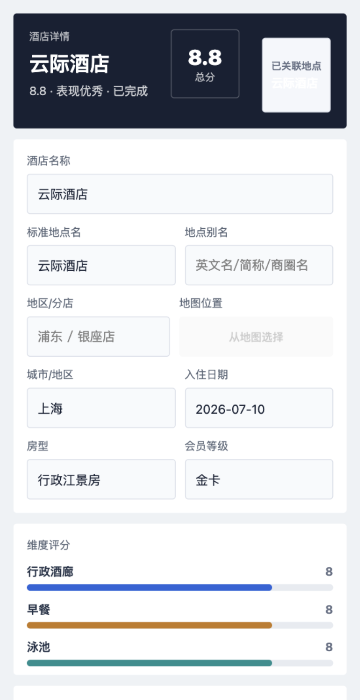
</p>

<p align="center"><em>体验详情会把总分、结论和各分类评分放在最容易扫读的位置。</em></p>

常用操作：

- 编辑：覆盖原记录并更新修改时间，不会新增重复记录。
- 复制：保留内容进入新增页，生成新的记录 ID 和创建时间，适合二刷或再次入住。
- 删除：二次确认后删除当前体验；关联地点不会因此被静默删除。
- 再次入住/再次用餐：从地点详情创建新体验，并带入地点、名称、城市和地址。

编辑页修改内容后直接返回，会出现未保存提醒。保存、确认放弃或删除后，提醒会自动解除。

### 3.4 照片、封面与故事

每条体验最多保存 9 张照片，可以：

- 从相册选择或拍照。
- 为照片选择分类并填写说明。
- 调整顺序并指定封面。
- 从单条体验生成照片故事长图，最多选 6 张照片。

照片保存在小程序本地持久目录。若系统清理了文件，页面会显示失效占位，不会出现破损图片；JSON 备份只保存照片路径与说明，不包含照片二进制，因此跨设备恢复不能自动带回原图。

### 3.5 搜索、筛选和排序

首页搜索可匹配名称、城市、备注、标签、菜系、米其林等级、房型和会员等级。可组合使用：

- 类型：全部、酒店、餐厅。
- 状态：全部、已完成、草稿。
- 排序：最近创建、日期最新、评分最高、评分最低。
- 标签：点击标签视图中的标签进一步筛选。

筛选条件会同步影响记录、地点、时间线、城市和标签统计。找不到结果时可一键清除条件，不会误导用户重新创建内容。

## 4. 管理地点与想去清单

### 4.1 地点与多次到访

“记录”代表一次具体入住或用餐，“地点”代表现实中的同一家酒店或餐厅。多次到访关联到同一地点后，地点详情会显示：

- 到访次数、个人平均分和最高分。
- 最近一次评分和评分变化趋势。
- 按日期排列的全部到访记录。
- 城市、地区、地址和可选地图位置。

新增体验时，系统只在相同类型中查找名称完全一致、别名一致或名称互相包含的地点，并把同城候选排在前面。你必须明确选择“关联已有地点”或“创建新地点”，系统不会按名称静默合并。

地点改名不会改写历史体验中的名称快照。发现重复地点时，可从地点详情手动合并：来源地点的记录会转移到目标地点，旧名称会加入别名。仍有关联记录的地点不能直接删除；空地点才可删除。

### 4.2 地图位置

编辑地点或体验时，可以使用微信的“选择位置”填写名称、地址和经纬度。地图定位是可选增强：拒绝位置授权或选择失败时，仍可手工填写名称、城市、地区和地址并正常保存。

旅行地图会聚合：

- 已到访且有坐标的酒店和餐厅。
- 想去清单中有坐标的项目。
- 缺少坐标、暂时无法显示在地图上的内容。

旅行地图不需要读取当前位置才能查看个人档案。

### 4.3 想去清单

想去项支持三种状态：想去、已预订、已到访。可以填写优先级、目标日期、预算、预订编号、同行人、参考链接和计划备注。

从想去项可以继续完成以下动作：

- 创建预订，并回写“已预订”、日期和预订编号。
- 加入指定行程。
- 记录到访，自动带入地点信息；体验真正保存成功后才标记为“已到访”。

想去清单支持名称搜索、类型筛选、状态筛选和优先级排序。发现相似地点时同样需要用户确认，不会自动合并。

## 5. 用出发中心管理预订

“出发中心”用于统一管理住宿、餐厅、交通、门票和其他预订，也负责行前清单。

<p align="center">
  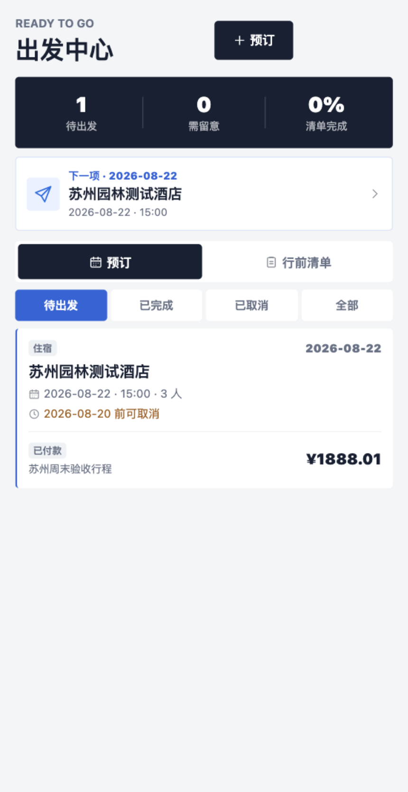
</p>

<p align="center"><em>顶部先提示待出发数量、取消期限和清单完成进度，再展示预订。</em></p>

### 5.1 新增预订

预订可以填写：

- 类型、名称、城市、地址。
- 开始与结束日期、具体时间。
- 人数、金额、币种、付款状态。
- 预订编号、取消政策、免费取消日期和具体截止时间。
- 关联的想去项、地点、行程、预算支出、AA 账本和体验记录。

取消截止时间临近 72 小时和 24 小时时，页面会提高提示优先级；已经过期时会明确标记。编辑预订后直接返回，同样会触发未保存提醒。

<p align="center">
  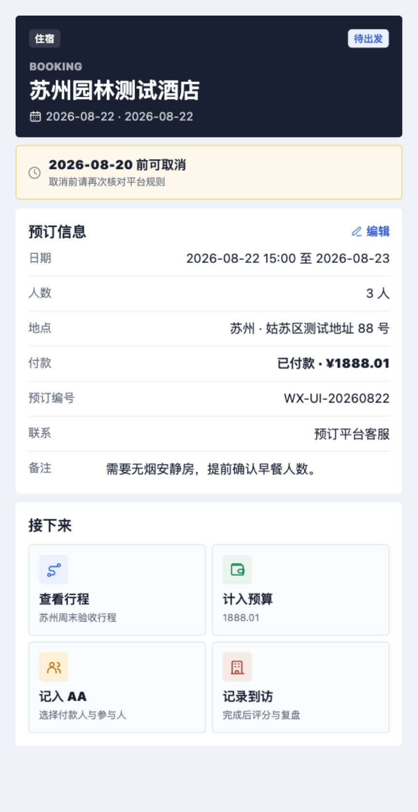
</p>

<p align="center"><em>预订详情集中展示日期、付款与取消信息，并提供四个后续动作。</em></p>

### 5.2 把预订接入旅行流程

预订详情提供四类后续操作：

| 操作 | 结果 |
| --- | --- |
| 加入行程 | 自动带入日期、时间、地点、金额和预订编号；重复操作不会重复创建日程 |
| 计入预算 | 生成一条关联的行程个人支出，并防止重复计入 |
| 加入 AA | 预填支出名称、金额、分类和日期；付款人、参与人和分摊方式仍需确认 |
| 记录体验 | 酒店或餐厅到访后创建体验，带入名称、日期、地点和关联信息 |

删除预订不会静默删除已关联的行程、支出或体验，避免误伤其他数据。

### 5.3 行前清单

清单可以绑定具体行程，也可以保存在“通用清单”。内置模板包含证件、预订确认、通讯、保险、药品和充电设备等事项。

- 重复补齐模板不会生成重复任务。
- 每项任务可设置负责人、完成状态和备注。
- 任务支持编辑和删除。
- 出发中心会汇总整体完成进度。

## 6. 规划行程与预算

### 6.1 建立行程

“行程”入口按进行中、即将开始、已结束和已归档组织旅行。新建行程时可设置：

- 行程名、一个或多个城市。
- 开始和结束日期。
- 本位币、总预算和分类预算。
- 备注与归档状态。

<p align="center">
  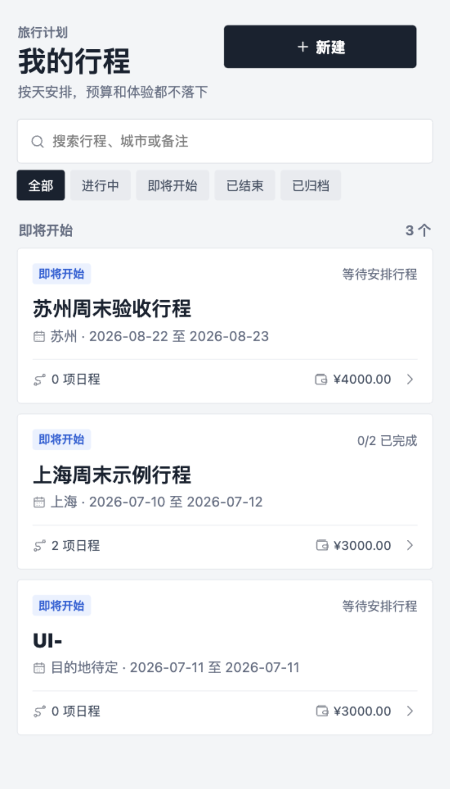
</p>

<p align="center"><em>行程卡同时展示日期、日程数量、状态、完成度和预算摘要。</em></p>

### 6.2 安排每日时间线

进入行程后，可按天新增酒店、餐厅、交通、景点或其他日程。每项日程可填写时间、名称、地点、金额、备注和关联体验。

<p align="center">
  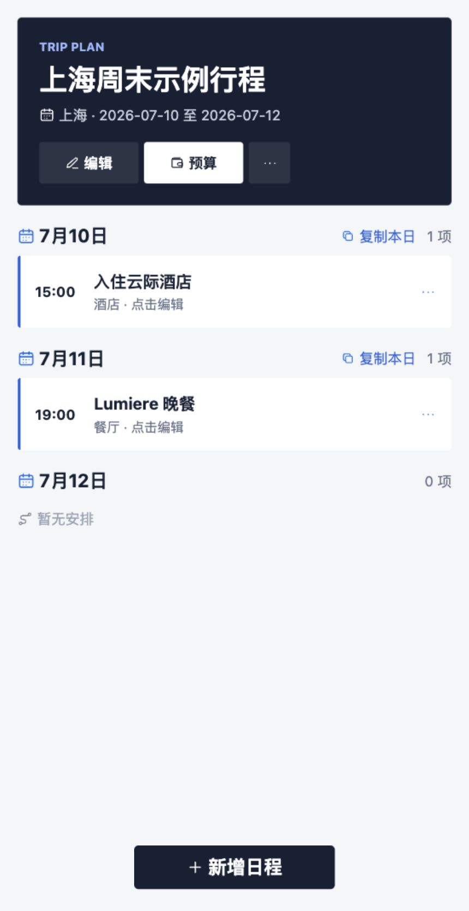
</p>

<p align="center"><em>日程按天分组，可直接编辑、复制本日或从底部继续添加。</em></p>

日程支持：

- 点击已有日程编辑。
- 同一天内上下调整顺序。
- 复制单条日程或复制整天安排。
- 移动到行程范围内的其他日期。
- 时间重叠时显示冲突提醒。

复制整段行程时会保留日程结构和预算设置，但会清空实际支出、关联账本和到访记录，适合复用旅行模板。

### 6.3 预算中心

点击行程顶部“预算”进入预算中心。

<p align="center">
  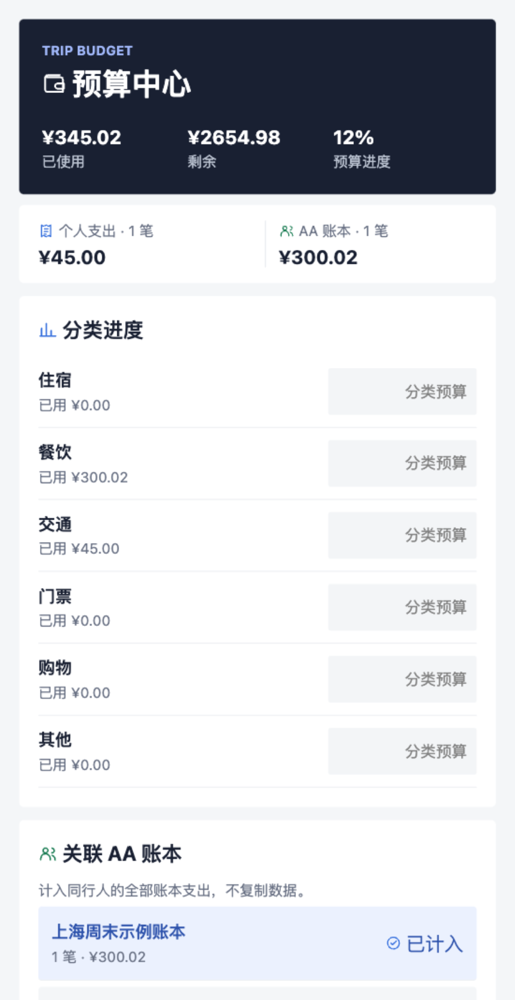
</p>

<p align="center"><em>预算中心把个人支出和关联 AA 账本分开显示，再汇总到分类进度。</em></p>

预算由两种来源组成：

1. 个人支出：直接在预算中心新增，可编辑、删除，日期必须位于行程范围内。
2. AA 账本：实时读取所选账本的共同支出，不复制数据。

这种设计可避免同一笔费用既记在 AA 账本、又被复制成个人支出而重复统计。外币支出可填写原币、固定汇率和日期；系统将折算结果保存为整数分，汇率必须大于 0。

## 7. 使用 AA 账本精确分账

AA 账本用于解决“谁先付了多少钱、这笔钱由哪些人承担、最后谁应给谁多少钱”。所有金额内部统一按整数分计算，避免浮点误差。

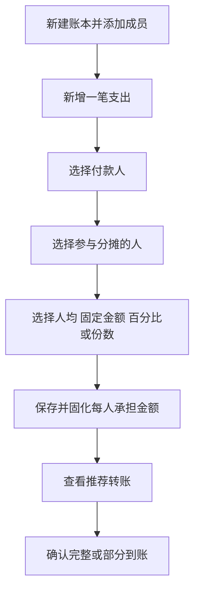

### 7.1 新建账本和成员

在底部点击“AA 账本”，再点击“新建”。填写账本名称、目的地、日期和备注，然后逐个新增同行人。

成员使用稳定 ID 保存：成员改名不会改变历史支出归属。已经出现在支出或转账历史中的成员不能被静默删除，但可以归档；归档后不会默认参与新支出。

### 7.2 记录支出

每笔支出需要确认：

- 支出名称、金额、分类和日期。
- 实际付款人。
- 参与分摊的人，可以只选同行人中的一部分。
- 分摊方式及对应数值。
- 可选私密备注。

支持四种分摊方式：

| 方式 | 适合场景 | 校验规则 |
| --- | --- | --- |
| 人均 | 大家平均承担 | 尾差按稳定成员顺序分配 |
| 固定金额 | 每人承担金额已知 | 合计必须等于支出金额 |
| 百分比 | 按约定比例承担 | 合计必须为 100% |
| 份数 | 儿童半份、不同房型等 | 每人的份数必须是正整数 |

例如三人平均分摊 300.02 元，系统会固化为 100.01、100.01、100.00 元，三人的承担金额严格相加为 300.02 元，不会丢失两分钱。

### 7.3 看懂成员净额

账本会为每人计算：

```text
净额 = 已付金额 - 应承担金额 - 已转出金额 + 已收到金额
```

- 净额为正：这个人先垫付较多，应收回钱。
- 净额为负：这个人承担不足，应向别人转账。
- 所有人净额之和始终为 0。

“结算”页会自动生成尽量精简的推荐转账方案。实际到账时可以确认完整金额，也可以输入部分金额；系统随后按剩余余额重新计算建议。已确认的转账可以撤销，并保留历史记录。

### 7.4 导出结算结果

AA 账本可导出：

- 结算图片，适合发到同行群里。
- 私人 PDF，保留真实成员和完整金额。
- 匿名分享 PDF，稳定匿名化成员名称并隐藏私密备注。
- 完整明细 JSON，便于备份和机器读取。

导出前请再次确认所选隐私模式，尤其不要把私人版误发到公开渠道。

## 8. 用决策转盘做选择

从首页“旅行工具”进入“决策转盘”。一个转盘可保存 2 至 50 个等概率选项，例如餐厅、周末目的地或当天活动。

### 8.1 准备选项

1. 新建转盘或选择已有转盘。
2. 在批量输入区每行输入一个选项。
3. 添加后可编辑名称、调整顺序、临时停用或删除选项。
4. 至少启用两个选项后才能旋转。

### 8.2 开始旋转

可以点击旋转按钮，也可以直接用手拨动转盘。转盘按真实手势速度进行惯性衰减，固定指针决定最终命中的扇区；动画只作用于转盘 canvas，页面主体不会跟着抖动，也不会触发设备震动。

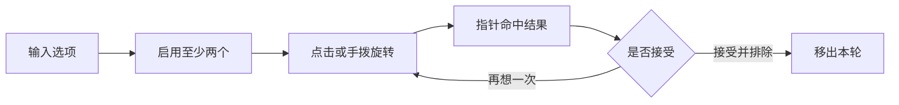

抽中后可以“再转一次”或“移出本轮”。每个转盘最多保留最近 50 条抽取历史，并会包含在完整 JSON 备份中。

## 9. 回顾旅行与生成作品

首页展开“全部旅行工具”后，可以使用以下回顾功能：

| 工具 | 内容 |
| --- | --- |
| 旅行洞察 | 按年份查看酒店/餐厅构成、个人最佳、月度频次、评分轨迹、常去城市、常用标签和复访变化 |
| 旅行地图 | 聚合已到访地点和想去项，按类型和状态筛选，并列出缺少坐标的内容 |
| 照片故事 | 从一条体验选择最多 6 张照片，调整版式、顺序和公开字段，生成长图 |
| 年度回忆册 | 按月份整理体验和年度最佳，最多选择 24 张照片，生成分享长图或私人多页 PDF |
| 待整理中心 | 检查疑似重复地点、资料缺失、孤立记录、未评分内容、长期草稿、重复想去项和失效照片 |

年度回忆册的分享长图不包含 AA 金额。私人 PDF 可以选择加入年度 AA 聚合金额，但不会输出成员或支出明细。

待整理中心中的合并地点、删除照片和清理文件等操作均需要确认。无主照片只从应用自身的媒体登记表识别，不会把 PDF 或其他文件误判为照片。

## 10. 备份、恢复与隐私导出

从首页“旅行工具”进入“数据管理”。建议在重要旅行结束后、清理微信缓存前或更换设备前创建完整 JSON 备份。

### 10.1 完整 JSON 备份

当前备份格式为 `schemaVersion: 9`，包含：

- 酒店和餐厅体验、地点、想去清单。
- 行程、个人预算、表单模板。
- AA 账本、成员、支出和结算记录。
- 决策转盘和抽取历史。
- 预订、行前清单和部分导出偏好。

备份不包含照片二进制，只保存照片路径、分类和说明。

### 10.2 恢复方式

选择 JSON 文件并校验成功后，可以：

- 合并导入：保留当前数据，跳过已存在的内容；发生 ID 冲突时稳定重映射关联字段。
- 覆盖导入：用备份替换当前相关缓存，执行前会明确列出影响范围。

系统兼容 v1 至 v8 旧备份。恢复会统一写入多个本地缓存；任一写入失败时自动回滚到导入前快照，避免只恢复一半。

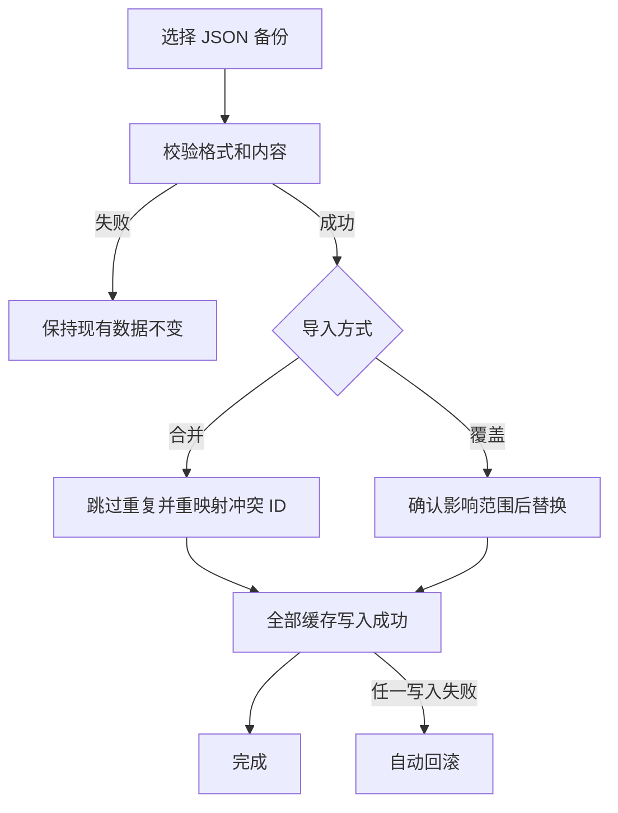

### 10.3 私人版与脱敏版

体验报告和数据导出区分：

| 模式 | 适合用途 | 处理方式 |
| --- | --- | --- |
| 私人版 | 自己保存、完整归档 | 保留更完整的日期、会员、价格和备注 |
| 脱敏版 | 发给朋友或公开展示 | 日期降为月份，隐藏会员等级、价格、私密备注、真实成员名、精确地址和经纬度 |

公开预览和未来公开评论载荷默认不包含精确地址、经纬度、设备 ID、内部同步 ID、本地照片路径或私密备注。

### 10.4 本地数据边界

当前版本没有账号和云同步：

- 卸载小程序、清理小程序数据或系统回收文件可能导致本地内容丢失。
- 在另一台设备登录同一微信，不代表数据会自动出现。
- JSON 备份可恢复结构化数据，但照片需要另外保管原图。
- 选择地图位置需要微信位置权限；拒绝后仍可手工录入。

## 11. 使用新手演示

首页出现“开始新手演示”时，点击即可进入。演示会创建一组带登记 ID 的固定示例，包括酒店、餐厅、行程、预算、三人非整除分账和决策转盘。

演示任务只有在目标页面成功打开后才会计为完成。目标页顶部会显示当前任务提示，并提供“返回演示”入口。中途退出后，首页仍会显示“演示中”和完成进度，可以继续、重新开始或退出。

演示数据缺失时会在继续任务时自动补齐。退出演示只删除由演示登记的数据，不清理个人创建的记录。

建议第一次使用时按以下顺序体验：

1. 从首页打开示例酒店，观察评分和地点关系。
2. 打开示例行程，查看按天安排和预算来源。
3. 打开示例 AA 账本，核对三人承担金额与推荐转账。
4. 打开决策转盘，尝试点击旋转和手拨旋转。

## 12. 推荐工作流

### 12.1 从“想去”到旅行归档

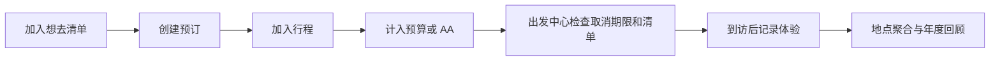

这是功能最完整的路径，适合正式旅行计划。想去项、预订、行程、预算和体验之间通过 ID 关联，重复点击已有动作时会尽量打开原内容而不是重复创建。

### 12.2 旅行结束后再补录

1. 用“快速记录”先保存名称、城市和日期。
2. 回家后编辑草稿，补充评分、照片、标签和备注。
3. 若同一地点已有记录，确认关联到已有地点。
4. 在旅行洞察、地图或回忆册中回顾。

### 12.3 多人旅行记账

1. 出发前建立 AA 账本并新增所有成员。
2. 每笔共同费用只记录一次，准确选择付款人和实际参与人。
3. 固定金额、百分比和份数模式保存前，先检查合计提示。
4. 旅行途中先记录支出，旅行结束后统一查看“结算”。
5. 每次收到转账就确认实际到账金额；全部净额归零后账本显示“已结清”。
6. 给同行人发送匿名分享 PDF 或结算图片，私人版留作个人归档。

### 12.4 定期数据维护

建议每次旅行结束后执行一次：

1. 打开待整理中心，处理重复地点和长期草稿。
2. 查看行程、预订和 AA 是否已完成或结清。
3. 生成一次完整 JSON 备份。
4. 将照片原图另外保存在相册或自己的文件管理方案中。

## 13. 常见问题

### 为什么快速记录没有分数？

快速记录和草稿会标记为“未评分”，避免默认分数污染个人平均分。编辑并保存为已完成记录后才会参与统计。

### 同名酒店为什么出现两个地点？

系统不会按名称自动合并，以免把同名分店或不同城市的地点混在一起。进入地点详情，确认确实重复后再使用“合并重复地点”。

### 修改地点名称后，旧记录为什么还是旧名称？

体验保存的是当次到访的名称快照。地点改名只影响地点档案，不会篡改历史记录。

### 行程预算为什么和 AA 总额不同？

预算中心只统计当前行程选中的 AA 账本，并将其与个人支出分开。请检查账本是否已关联、支出币种与汇率是否正确，以及同一费用是否又被手工记成个人支出。

### 三人平均分摊为什么有人多一分钱？

人民币的最小单位是分。无法整除时，尾差必须由部分成员承担；系统按稳定成员顺序分配尾差，并保证所有人的承担金额之和严格等于原支出。

### 删除成员按钮为什么不可用？

该成员已经出现在历史支出或转账中。为保证账目可追溯，只能将其归档，不能静默删除。

### JSON 恢复后为什么没有照片？

备份只保存本地照片路径和元数据，不包含图片本身。跨设备时原路径无效，需要重新添加照片；同设备且文件仍存在时可以继续显示。

### PDF 中文会乱码吗？

报告先在隐藏 canvas 中绘制中文页面，再把页面图片封装为 PDF，从而避免依赖 PDF 中文字体。生成后会写入小程序用户目录并打开预览。

### 拒绝地图权限还能使用吗？

可以。地图位置是可选信息，名称、城市、地区和地址都支持手工填写。

### 数据会自动同步到另一台手机吗？

不会。当前版本是本地优先纯前端应用，没有账号和云同步。请使用完整 JSON 备份保存结构化数据，并单独保存照片原图。

---

如需开发、调试、数据结构和自动化测试说明，请返回项目根目录阅读 [README](../README.md)。
